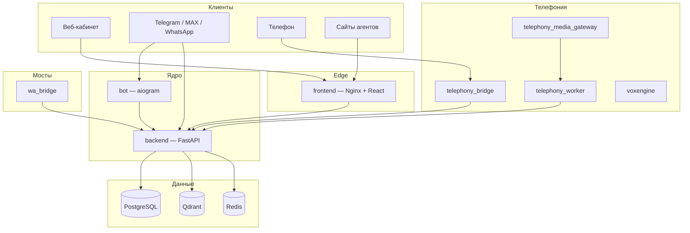

# RSD — платформа ИИ-агентов для бизнеса

**RSD** ([rsd-ai.ru](https://rsd-ai.ru)) — no-code платформа для создания и запуска ИИ-агентов: поддержка клиентов, продажи, администрирование записи, генерация контента и голосовые операторы. Агенты работают в мессенджерах, на сайте и по телефону, опираясь на загруженную базу знаний и подключаемые CRM.

Платформа развивается в сторону **портала цифровизации бизнеса** (сущность «Проект») — см. [backlogs/PROJECT_PORTAL_PLAN.md](backlogs/PROJECT_PORTAL_PLAN.md).

---

## Возможности

| Направление | Что умеет |
|-------------|-----------|
| **ИИ-агенты** | Шаблоны ролей (QA, CRM-админ, sales, контент-завод, логист, менеджер), промпт, RAG по документам |
| **Каналы** | Telegram (бот и userbot), MAX, WhatsApp, виджет на сайте |
| **Телефония** | Входящие звонки через Voximplant, streaming STT/TTS, AI-оператор |
| **Website Builder** | AI-генерация лендингов, конструктор блоков, кастомные домены, SEO |
| **CRM** | AmoCRM, Bitrix24; запись на приём, заявки, внутренний Sales CRM |
| **Платежи** | Подписки и биллинг агентов через YooKassa |
| **Партнёрка** | Промокоды, выплаты |
| **Автоматизация** | Content Factory, Article Publisher, AI MOP (лидогенерация), `/custom` mass social automation |

---

## Архитектура (высокий уровень)



**Поток сообщений:** каналы (userbot-менеджеры, Telegram-бот) → `MessageProcessor` → `TemplateRuntimeService` → LLM + tools (CRM, booking, HTTP).

Массовые автоматизации `/custom` (пул Telegram-аккаунтов, нейрокомментинг, перехват заявок, DMP.one, AmoCRM): актуальный план [backlogs/CUSTOM_AGENTS_V2_PLAN.md](backlogs/CUSTOM_AGENTS_V2_PLAN.md), runbook [docs/custom/RUNBOOK.md](docs/custom/RUNBOOK.md).

---

## Стек технологий

### Backend (`backend/`)

| Слой | Технологии |
|------|------------|
| API | Python 3.13+, **FastAPI**, Uvicorn |
| БД | **PostgreSQL 15**, SQLAlchemy 2, Alembic |
| Векторный поиск | **Qdrant**, sentence-transformers |
| Кэш / telephony state | **Redis** |
| Auth | JWT (users, admin, sales), bcrypt |
| LLM | DeepSeek, OpenRouter, Groq (конфигурируемо) |
| STT | faster-whisper, OpenAI API |
| Платежи | YooKassa |
| Мессенджеры | Telethon (userbot), maxapi-python, wa_bridge |
| Документы | pdfplumber, python-docx, langchain-text-splitters |

### Frontend (`frontend/`)

| Слой | Технологии |
|------|------------|
| UI | **React 19**, React Router 7 |
| Сборка | **Vite 7**, React Compiler |
| HTTP | Axios |
| Website Builder | @dnd-kit, DOMPurify |

### Микросервисы

| Сервис | Стек | Назначение |
|--------|------|------------|
| `bot/` | aiogram | Telegram-боты агентов |
| `telephony_bridge/` | Node.js, Express, TypeScript | Webhook Voximplant, control plane |
| `telephony_media_gateway/` | Node.js, WS, ONNX VAD, gRPC | Аудиопоток, STT/TTS pipeline |
| `wa_bridge/` | Python | WhatsApp userbot bridge |
| `voxengine/` | JavaScript (VoxEngine) | Сценарий входящего звонка |

### Инфраструктура

- **Docker Compose** — локальная и prod-сборка всех сервисов
- **Nginx** — фронт, SSL, прокси к backend, домены website builder
- Деплой: [deployment/VPS_STAGE2_DEPLOY.md](deployment/VPS_STAGE2_DEPLOY.md)

---

## Структура репозитория

```
RSD/
├── backend/                 # FastAPI-приложение (server.py)
│   └── app/
│       ├── router_*/        # HTTP API по доменам
│       ├── services/        # Бизнес-логика, воркеры
│       ├── channels/        # Userbot-менеджеры (TG, MAX, WA)
│       ├── telephony/       # Голосовой runtime
│       ├── qdrant/          # Embeddings и поиск
│       └── alembic/         # Модели и миграции
├── frontend/                # React SPA + website builder
├── bot/                     # Telegram bot service
├── telephony_bridge/        # Voximplant webhook bridge
├── telephony_media_gateway/ # Media WS gateway
├── wa_bridge/               # WhatsApp bridge
├── voxengine/               # Voximplant сценарии
├── docs/                    # Документация по модулям
├── backlogs/                # Планы, оценки стека, roadmap
├── deployment/              # Nginx, скрипты деплоя
├── schemas/                 # JSON Schema (telephony и др.)
└── security-tools/          # Скрипты аудита и hardening VPS
```

---

## Быстрый старт (Docker)

### Требования

- Docker и Docker Compose
- Файл `.env` в корне (секреты, ключи API, БД)

Минимально нужны: `DB_*`, `SECRET_KEY`, `ENCRYPTION_KEY`, `DEEPSEEK_API_KEY`, `QDRANT_URL`, `WA_USERBOT_SESSION_SECRET` и др. — см. `docker-compose.yml` и `.env.telephony.example` для телефонии.

### Запуск

```bash
# из корня репозитория
docker compose up -d --build
```

Сервисы в compose:

| Сервис | Описание |
|--------|----------|
| `postgres` | Основная БД |
| `redis` | Кэш, telephony |
| `qdrant` | Векторное хранилище документов |
| `backend` | API :8000 (внутри сети) |
| `frontend` | Nginx :80/:443 |
| `bot` | Telegram-боты |
| `wa_bridge` | WhatsApp |
| `telephony_*` | Bridge, worker, orchestrator, media gateway (при `TELEPHONY_ENABLED`) |

Локальная отладка с пробросом портов — `docker-compose.override.example.yml`.

### Backend без Docker

```bash
cd backend
pip install -r requirements.txt
cd app/alembic && alembic upgrade head
cd ../.. && python server.py
```

### Frontend без Docker

```bash
cd frontend
cp .env.example .env   # при необходимости
npm install
npm run dev
```

### Тесты backend

```bash
cd backend/app/tests
pytest
```

---

## API (основные префиксы)

| Префикс | Назначение |
|---------|------------|
| `/api/users` | Регистрация, auth, профиль |
| `/api/agents` | Агенты, каналы, аналитика |
| `/api/v1/agents` | Публичный API (booking, leads) |
| `/api/documents` | База знаний, RAG |
| `/api/payments` | Подписки, YooKassa |
| `/api/referrals` | Партнёрский кабинет |
| `/api/admin` | Админ-панель |
| `/api/sales` | Sales CRM |
| `/api/v1/websites` | Website Builder |
| `/api/internal/telephony` | Internal telephony API |
| `/public-website` | Опубликованные сайты |

Swagger (`/docs`) доступен только при `ENVIRONMENT=development`.

---

## Шаблоны агентов (`template_type`)

| Тип | Назначение |
|-----|------------|
| `qa` | Ответы по базе знаний, эскалация на человека |
| `crm_admin` | Запись, услуги, CRM tools |
| `sales_manager` | Продажи, outreach, FSM лидов |
| `content_factory` | Генерация и публикация контента |
| `lead_generation` | Лидогенерация |
| `ai_logist` | Логистические сценарии |
| `ai_manager` | ИИ-менеджер / телефония |

---

## Документация

### Индексы

| Документ | Содержание |
|----------|------------|
| [docs/README.md](docs/README.md) | Карта всей документации |
| [docs/backend/README.md](docs/backend/README.md) | Модули backend, API surface |
| [docs/telephony/README.md](docs/telephony/README.md) | Телефония: Voximplant, streaming, env |
| [docs/website-builder/README.md](docs/website-builder/README.md) | Website Builder (production-ready) |

### Backlogs (планы и оценки)

| Документ | Содержание |
|----------|------------|
| [backlogs/README.md](backlogs/README.md) | Индекс всех планов |
| [backlogs/TECH_STACK_EVALUATION.md](backlogs/TECH_STACK_EVALUATION.md) | LangChain, Kafka, альтернативный стек |
| [backlogs/PROJECT_PORTAL_PLAN.md](backlogs/PROJECT_PORTAL_PLAN.md) | Эволюция в портал «Проект» |
| [backlogs/BACKEND_REFACTOR_PLAN.md](backlogs/BACKEND_REFACTOR_PLAN.md) | Дедупликация и ООП в backend |

### Runbook'и (операционная документация)

| Документ | Содержание |
|----------|------------|
| [deployment/VPS_STAGE2_DEPLOY.md](deployment/VPS_STAGE2_DEPLOY.md) | Деплой на VPS |
| [docs/telephony/RUNBOOK.md](docs/telephony/RUNBOOK.md) | Runbook телефонии |

### README сервисов

- [telephony_bridge/README.md](telephony_bridge/README.md)
- [telephony_media_gateway/README.md](telephony_media_gateway/README.md)
- [wa_bridge/README.md](wa_bridge/README.md)
- [voxengine/README.md](voxengine/README.md)

---


## Лицензия и контакты

Проприетарный проект. Публичный сайт: [rsd-ai.ru](https://rsd-ai.ru).

---

*При добавлении нового модуля — создайте `README.md` в `docs/backend/<module>/` и ссылку в [docs/README.md](docs/README.md).*
