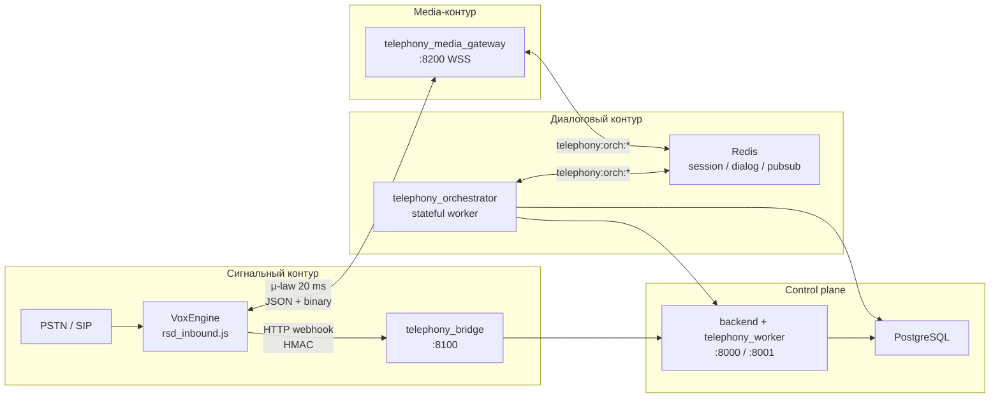

# Архитектура модуля телефонии RSD (streaming PSTN)

Документ описывает **текущую** реализацию после рефакторинга на потоковый pipeline. Детали протокола и env — в [docs/telephony/SESSION_PROTOCOL.md](docs/telephony/SESSION_PROTOCOL.md), [docs/telephony/STREAMING_ARCHITECTURE.md](docs/telephony/STREAMING_ARCHITECTURE.md), [.env.telephony.example](.env.telephony.example).

---

## 1. Обзор: три контура

Звонок разделён на независимые слои, которые масштабируются отдельно:



| Контур | Компоненты | Транспорт | Задача |
|--------|------------|-----------|--------|
| **Сигнальный** | Voximplant VoxEngine, `telephony_bridge` | HTTPS webhook (RFC-001) | Early Media, answer, hangup, resolve DID/SIP, метаданные звонка в БД |
| **Media** | `telephony_media_gateway` | WebSocket (μ-law) | VAD, streaming STT, turn-taking, приём/отдача TTS, barge-in |
| **Диалог** | `telephony_orchestrator` | Redis pub/sub | LLM stream, нарезка синтагм, stream TTS, CRM/tools, маршрутизация DTMF |
| **Control** | `backend`, `telephony_worker` | REST internal | Credentials, resolve, аналитика, **preview в браузере** (отдельный путь) |

**Не используется в PSTN:** HTTP `POST /internal/telephony/turn` с записью и batch STT — для prod-звонка bridge отвечает `410` на legacy-события.

---

## 2. Карта репозитория

| Путь | Роль |
|------|------|
| `voxengine/rsd_inbound.js` | Сценарий входящего: Early Media, greeting, answer, WS к gateway, DTMF → WS |
| `voxengine/lib/rsd_control.js` | Подписанные webhook → bridge |
| `voxengine/lib/rsd_media_gateway.js` | `session.start`, `sendMediaTo`, barge-in → `clearMediaBuffer` |
| `telephony_bridge/` | Control-only: `call.inbound` / `call.answered` / `call.hangup` |
| `telephony_media_gateway/` | Media plane: VAD (Silero), STT (Yandex/Deepgram), WS-сессия |
| `backend/app/telephony/orchestrator_main.py` | Точка входа воркера |
| `backend/app/telephony/orchestrator_worker.py` | Affinity по `call_id`, обработка Redis-событий |
| `backend/app/telephony/stream_pipeline.py` | LLM → синтагмы → stream TTS → Redis replies |
| `backend/app/telephony/routing.py` | DTMF / DID / SIP → Redis keys |
| `backend/app/router_telephony/` | Internal API, resolve, call-event |
| `frontend` + preview API | Тест агента в браузере **без** gateway |

---

## 3. Пайплайн звонка (фазы)

### Фаза 0 — До звонка (control plane)

1. В UI подключается канал Voximplant → `connection_id`, `webhook_secret`, номер(а).
2. Опционально: `routing_extension` (DTMF), `inbound_numbers[]` (DID), SIP routes → Redis.
3. В Voximplant загружается сценарий + secrets (`RSD_WEBHOOK_*`, `TELEPHONY_MEDIA_WS_URL`).

### Фаза I — Инициация (сигнал + Early Media)

```text
Абонент набирает номер
  → VoxEngine CallAlerting
  → POST call.inbound → bridge → backend (resolve-inbound, call-event, ringing)
  → startEarlyMedia() + приветствие (greeting_url / TTS / disclaimer)
  → call.answer()
  → POST call.answered → bridge → backend (status active)
  → WebSocket к media gateway + session.start
  → call.sendMediaTo(ws, ULAW) — RTP μ-law в приложение
```

Параллельно с проигрыванием приветствия backend уже может положить resolve в Redis (`telephony:session:{connection_id}`).

### Фаза II — Входящий поток (пока абонент говорит)

На **каждые ~20 ms** (кадр μ-law):

```text
VoxEngine → gateway: audio.in (binary 0x01)
  → Silero VAD (речь / тишина)
  → если речь: кадры в streaming STT (Yandex gRPC v3 REAL_TIME или Deepgram)
  → stt.partial → Redis → orchestrator (логика / будущий early intent; не блокирует ответ)
```

**Turn-taking:** после конца фразы VAD фиксирует тишину ≥ `TURN_SILENCE_MS` (default 400 ms) → один `stt.final` → Redis → orchestrator начинает ход.

### Фаза III — Исходящий поток (ответ агента)

После `stt.final` orchestrator (один asyncio-task на `call_id`):

```text
1. Загрузка контекста из Redis (prompt, history) — минимум Postgres
2. template_runtime / LLM stream (chat или Groq)
3. Нарезка токенов по , . ! ? → синтагмы (min TELEPHONY_SYNTAGMA_MIN_CHARS)
4. На каждую синтагму: stream TTS (Yandex gRPC / ElevenLabs) → μ-law chunks
5. Redis telephony:orch:replies → gateway → WS audio.out → VoxEngine → абонент
6. Батч-запись turn в Postgres на stt.final / hangup
```

Пока LLM дописывает хвост фразы, абонент уже слышит **первые синтагмы** (потоковый TTS).

### Фаза IV — Barge-in (опционально, во время речи бота)

```text
VAD видит речь абонента при активном agent.audio.*
  → gateway: barge_in (WS → VoxEngine clearMediaBuffer)
  → gateway: barge_in (Redis → orchestrator)
  → orchestrator: stream_cancel, agent.audio.end (reason barge_in)
  → озвученный текст → telephony:spoken:{call_id}
  → следующий stt.final уходит с interrupted_agent_text
```

### Фаза V — Завершение

```text
Абонент кладёт трубку
  → VoxEngine: session.end + POST call.hangup
  → orchestrator: flush turns, purge_hot_dialog в Redis
  → Postgres: финальный status звонка
```

### Маршрутизация (параллельно с фазой I–II)

| Вариант | Триггер | Действие |
|---------|---------|----------|
| **A — DTMF** | `require_extension` + 4 цифры на WS | Redis `telephony:route:dtmf:{ext}` → `agent_id`, смена промпта |
| **B — DID** | `called_e164` на inbound | Redis `telephony:route:did:{e164}` → `connection_id` |
| **C — SIP trunk** | Заголовки From/To | `telephony_sip_routes` → `connection_id` |

DTMF идёт в gateway (`type: dtmf`), не отдельным HTTP на каждую цифру.

---

## 4. Транспорты и каналы Redis

| Канал / ключ | Направление | Содержимое |
|--------------|-------------|------------|
| `telephony:orch:events` | gateway → orchestrator | `session.start`, `stt.partial`, `stt.final`, `barge_in`, `session.end`, `dtmf` |
| `telephony:orch:replies` | orchestrator → gateway | `agent.audio.*`, `agent.play_filler`, `call.transfer` |
| `telephony:session:{connection_id}` | backend → Redis | resolve, agent_id, credentials snapshot |
| `telephony:dialog:{call_id}` | orchestrator | последние N реплик |
| `telephony:spoken:{call_id}` | orchestrator | текст до barge-in |
| `telephony:route:dtmf:*` / `did:*` | API / inbound | маршрутизация |

WebSocket VoxEngine ↔ gateway: control JSON + binary `audio.in` / `audio.out` — см. [SESSION_PROTOCOL.md](docs/telephony/SESSION_PROTOCOL.md).

---

## 5. Пример живого диалога

**Сценарий:** входящий на выделенный DID, агент «запись на услугу», без DTMF.

| Время | Абонент слышит / делает | Система (упрощённо) |
|-------|-------------------------|---------------------|
| T+0 s | Гудки | PSTN → Voximplant |
| T+0.3 s | «Здравствуйте, слушаю вас» (Early Media) | `startEarlyMedia` + greeting |
| T+0.5 s | — | `call.inbound` → resolve → Redis session |
| T+1.2 s | Соединение установлено | `answer`, `call.answered`, WS `session.start` |
| T+2 s | «Хочу записаться на завтра на десять утра» | Поток `audio.in` → VAD+STT |
| T+2.1–4 s | (говорит) | `stt.partial`: «хочу запис» → «хочу записаться на завтра» |
| T+4.5 s | Пауза ~400 ms | `stt.final`: полная фраза → orchestrator |
| T+4.7 s | — | LLM TTFT, первая синтагма «Хорошо, записываю вас на завтра.» |
| T+5.0 s | Начало ответа агента | `agent.audio.start` + первые `audio.out` |
| T+5.0–8 s | Полный ответ + уточнение | LLM дописывает; TTS стримит 2–3 синтагмы подряд |
| T+9 s | «А какой адрес у вас?» | Снова partial → final → новый ход |
| T+9.5–12 s | Ответ с адресом | Тот же pipeline фазы III |
| T+15 s | Кладёт трубку | `session.end`, `call.hangup`, purge Redis, turns в Postgres |

**Реплика в БД:** после каждого `stt.final` — user text; после завершения ответа агента — agent text (батч, не на каждый partial).

---

## 6. Что происходит параллельно (один ход абонента)

Ниже — момент **с T+4.0 s** (абонент договорил фразу) **до T+8 s** (агент почти закончил ответ). Это главный «живой» участок pipeline.

```mermaid
gantt
    title Параллельные процессы одного хода (после конца речи абонента)
    dateFormat X
    axisFormat %Ls

    section Media GW
    VAD тишина → stt.final           :a1, 0, 400
    STT final wait                   :a2, 400, 480
    Приём audio.in (фон)             :a3, 0, 4000

    section Orchestrator
    Redis stt.final → lock call_id   :b1, 480, 520
    LLM stream токены                :b2, 520, 3500
    Синтагма 1 готова                :milestone, 900, 0
    Синтагма 2 готова                :milestone, 1800, 0
    CRM/tools (если есть)            :b3, 520, 2000
    Postgres batch turn              :b4, 3500, 3600

    section TTS (per syntagma)
  TTS синтагма 1                   :c1, 900, 1400
    TTS синтагма 2 (overlap LLM)     :c2, 1800, 2300
    TTS синтагма 3                   :c3, 2600, 3100

    section Gateway → Phone
    audio.out синтагма 1             :d1, 1100, 2000
    audio.out синтагма 2             :d2, 2000, 2900
    audio.out синтагма 3             :d3, 2900, 3800

    section VoxEngine
    RTP → абонент                    :e1, 1100, 3800
```



### Таблица параллелизма

| Поток | Действие | Параллельно с |
|-------|----------|----------------|
| **VoxEngine** | Шлёт `audio.in` каждые 20 ms | Всё время звонка |
| **Gateway VAD** | Анализ кадра | Каждый `audio.in` |
| **Gateway STT** | Partial transcripts | Пока VAD = speech |
| **Gateway** | Ждёт `TURN_SILENCE_MS` | STT ещё может слать partial |
| **Orchestrator** | Ждёт только **`stt.final`** | Partial не запускают новый LLM-ход |
| **LLM** | Стримит токены | После `stt.final`; синтагма 2 режется пока идёт TTS-1 |
| **TTS** | Синтез синтагмы N | LLM уже пишет синтагму N+1 |
| **Gateway** | Публикует `audio.out` | Как только есть байты TTS |
| **Абонент** | Слышит начало ответа | LLM ещё не закончил полный текст |
| **Barge-in** | VAD + cancel | Прерывает LLM, TTS и буфер VoxEngine одновременно |

**Последовательные зависимости (нельзя распараллелить):**

1. `stt.final` только после тишины VAD.  
2. Первая синтагма TTS — после первых токенов LLM (и после CRM, если шаблон с tools).  
3. Запись user-turn в Postgres — после принятого `stt.final` (батч с agent-turn позже).

**Намеренный параллелизм (latency):**

- LLM синтагма *k+1* формируется, пока TTS и RTP отдают синтагму *k*.  
- `stt.partial` идут в orchestrator для наблюдаемости; prod-ответ стартует на `stt.final`.  
- Early Media и `call.inbound` resolve идут до полного поднятия media WS.

---

## 7. Сравнение: PSTN vs preview в браузере

| | PSTN (звонок) | Preview (кабинет) |
|--|---------------|-------------------|
| Вход | Микрофон PSTN → Voximplant | WebRTC / upload / Web Speech |
| Media | `telephony_media_gateway` | Нет |
| STT | Streaming Yandex/Deepgram | Batch / браузер |
| LLM/TTS | Orchestrator + stream TTS | `POST /internal/telephony/turn` или preview API |
| Bridge | Только сигнальные события | Не используется |

---

## 8. Запуск стека (напоминание)

```bash
docker compose up -d redis postgres backend telephony_worker \
  telephony_bridge telephony_orchestrator telephony_media_gateway
```

Проверка: `curl http://127.0.0.1:8100/health` и `curl http://127.0.0.1:8200/health`.

Voximplant должен видеть публичные `https://` (bridge) и `wss://` (gateway) — не `localhost`.

---

## 9. Связанные документы

| Документ | Содержание |
|----------|------------|
| [TELEPHONY_STREAMING_REFACTOR.md](TELEPHONY_STREAMING_REFACTOR.md) | План рефакторинга, этапы |
| [TELEPHONY_COMPLETION_CHECKLIST.md](TELEPHONY_COMPLETION_CHECKLIST.md) | Что осталось до полной приёмки |
| [docs/telephony/ROUTING.md](docs/telephony/ROUTING.md) | DTMF / DID / SIP |
| [docs/telephony/RUNBOOK.md](docs/telephony/RUNBOOK.md) | Эксплуатация |
| [voxengine/README.md](voxengine/README.md) | Деплой сценария |
