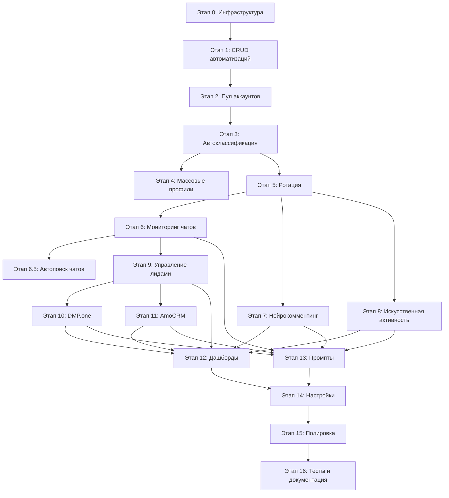

# План: Пространство кастомных агентов (`/custom`)

> **Устарело как ТЗ на UI.** Дальше работаем по [CUSTOM_AGENTS_V2_PLAN.md](./CUSTOM_AGENTS_V2_PLAN.md): оболочка как `/projects`, без новой админки.
>
> Этот файл — справочник модели данных, API, workers и рисков масштаба. Не реализовывать отсюда этапы 0–16 заново и не копировать описанный layout.
>
> Как пользоваться: искать имена таблиц и сервисов, если на них ссылается v2.

---

## 1. Видение и границы

### 1.1. Что такое `/custom`

Отдельное пространство внутри продукта для управления **массовыми автоматизациями в социальных сетях** (Telegram-каналы/чаты, потенциально ВК, другие площадки). В отличие от обычных ИИ-агентов, где один агент = один канал + один бот, в `/custom`:

- одна автоматизация использует **пул социальных аккаунтов**;
- аккаунты классифицируются и распределяются по ролям (доверенные, однодневки, средний уровень);
- массовые действия (профили, ротация, комментинг, перехват заявок) управляются через единый UI;
- все промпты, критерии и триггеры настраиваются в панели, а не захардкожены.

### 1.2. Бизнес-контекст

Продукт предоставляется как услуга по лидогенерации (цифровой партизанский маркетинг). В очереди два клиента:

- **SaaS для SEO-оптимизации (заказчик, партизанский маркетинг)** — нейрокомментинг, перехват заявок в чатах, искусственная активность, DMP.one. **AmoCRM не нужен** — лиды передаются напрямую заказчику (Telegram/другой канал, настраивается в `lead_manager_contact`).
- **Фулфилмент (A2)** — нейрокомментинг в чатах селлеров, перехват заявок по фулфилменту/карго, DMP.one, искусственная активность, интеграция с AmoCRM.

Важное уточнение: телефония и SashaAI не используются. Для прогрева лидов используются **Telegram-аккаунты из пула** (в основном `mid`/`one_day`, реже `trusted`).

### 1.3. Что остаётся без изменений

| Функция | Примечание |
|---------|------------|
| Обычные ИИ-агенты (`/agents`, `/projects`) | `/custom` — параллельная подсистема, не заменяет существующих агентов |
| Создание/редактирование обычных агентов | Без изменений |
| Телефония / SashaAI | В `/custom` не используется для лидов |
| Billing per обычный агент | `/custom` может иметь собственную биллинг-логику позже |

### 1.4. Что входит в scope

- Авторизация: админский доступ и персональный доступ к каждой автоматизации.
- Управление пулом аккаунтов (массовый залив, классификация, профили, ротация).
- Управление чатами/каналами: массовый импорт из Excel/CSV, автоматический поиск и вступление ИИ-агентом, дедупликация входящих сообщений от множества аккаунтов в одних чатах.
- Три режима работы: мониторинг чатов, нейрокомментинг, искусственная активность.
- Панель управления автоматизацией с редактируемыми промптами и настройками.
- Интеграция с DMP.one (выкуп данных + выход на контакт + учёт стоимости и купленных контактов).
- Интеграция с AmoCRM — **опциональная, per автоматизация** (нужна фулфилменту, не нужна SEO SaaS).
- Дашборды: сообщения, перехваченные/переданные/обработанные лиды, просмотр чатов, расходы на DMP и аккаунты.

### 1.5. Осознанно вне scope (этап 1)

- Поддержка соцсетей кроме Telegram (ВК, Instagram и т.д.) — оставить точки расширения, но реализовать Telegram.
- Телефония / SashaAI / собственный голосовой прогрев — не используется. Все коммуникации с лидами через Telegram-аккаунты пула.
- Автоматическая генерация видео-контента (ИИ-контент-завод) — отдельная функция, не входит в `/custom`.
- Биллинг клиента / тарификация автоматизаций для заказчика — на этапе 1 считаем внутренним инструментом компании, но фиксируем расходы (DMP, аккаунты).
- Инфраструктура для масштаба 100+ аккаунтов 

---

## 2. Модель доступа и авторизация

### 2.1. Два уровня доступа

| Уровень | Логин/пароль | Что видит | Примечание |
|---------|--------------|-----------|------------|
| **Администратор** | Один общий на `/custom` | Все автоматизации, все аккаунты, все статистики, настройки интеграций | Может создавать автоматизации и выдавать персональные доступы |
| **Клиент/оператор автоматизации** | Свой логин/пароль на конкретную автоматизацию | Только своя автоматизация, её аккаунты, чаты, лиды, статистика | Не видит других автоматизаций и админ-настройки |

### 2.2. UX-вход

```
/custom
    -> /custom/login
        -> Админ?    -> /custom/admin/dashboard
        -> Клиент?   -> /custom/automations/:id/dashboard
```

- Админский логин/пароль — из переменных окружения (`.env`) или отдельной таблицы `custom_admin`.
- Персональный доступ — логин/пароль, привязанные к `CustomAutomation` (таблица `custom_automation_credentials`).
- Авторизация — отдельные JWT-токены или reuse существующей сессионной схемы, но с claim `custom_automation_id` / `custom_admin`.
- Важно: клиентская сессия **не имеет доступа** к обычным `/agents`, `/projects` и к другим автоматизациям.

### 2.3. Модель данных доступа

```python
class CustomAdmin(Base):
    id: int PK
    username: str unique
    password_hash: str
    is_active: bool default True
    created_at, updated_at

class CustomAutomationCredential(Base):
    id: int PK
    custom_automation_id: FK -> custom_automations.id CASCADE
    username: str unique
    password_hash: str
    is_active: bool default True
    last_login_at: datetime nullable
    created_at, updated_at
```

---

## 3. Архитектура высокого уровня

### 3.1. Основные сущности

| Сущность | Назначение | Пример данных |
|----------|------------|---------------|
| `CustomAutomation` | Одна автоматизация = один клиент/одна кампания | название, клиент, целевая аудитория, промпты, статус |
| `SocialAccount` | Один Telegram-аккаунт (userbot) | phone, session, avatar, bio, status, account_class, risk_score, last_used_at, is_active, banned_at |
| `AccountPool` | Группировка аккаунтов для автоматизации | name, automation_id, default_account_class, rotation_strategy |
| `PoolAccount` | Связь многие-ко-многим между пулом и аккаунтом | account_id, pool_id, assigned_class, added_at, removed_at |
| `ChatTarget` | Чаты/каналы, где работает автоматизация | telegram_chat_id, title, invite_link, target_type, automation_id, active_mode |
| `ChatImportJob` | Массовый импорт чатов/каналов из Excel | automation_id, file_name, status, total, processed, errors, error_log |
| `ChatDiscoveryTask` | Задача авто-поиска тематических чатов ИИ | automation_id, status, query, found_chats, joined_chats, created_at |
| `ChatMessage` | Сообщения из чатов (для перехвата и аналитики) | chat_id, sender_id, text, is_processed, is_duplicate, matched_intent, dedup_key |
| `CustomLead` | Лид, полученный из чата или DMP | source, contact_type, contact_value, status, automation_id, assigned_account_id, chat_id, amocrm_lead_id |
| `CustomPrompt` | Настраиваемые промпты автоматизации | prompt_type, name, content, model, temperature, is_active, automation_id |
| `AutomationActionLog` | Лог действий аккаунтов | account_id, action_type, target_id, result, error, created_at |
| `DmpOneImport` | Закупленные у DMP.one данные + расходы | automation_id, requested_count, received_count, purchased_count, cost_rub, cpl_rub, status, created_at |
| `AmocrmConnection` | Подключение к AmoCRM | automation_id, subdomain, access_token_hash, pipeline_id, responsible_user_id, is_active |

### 3.2. Схема связей (кратко)

```
CustomAdmin (1)
CustomAutomation (N)  <- AccountPool (N) <- PoolAccount <- SocialAccount (N)
CustomAutomation (1) <- CustomAutomationCredential (N)
CustomAutomation (1) <- ChatImportJob (N)
CustomAutomation (1) <- ChatDiscoveryTask (N)
CustomAutomation (1) <- ChatTarget (N)
CustomAutomation (1) <- ChatMessage (N)
CustomAutomation (1) <- CustomLead (N)
CustomAutomation (1) <- CustomPrompt (N)
CustomAutomation (1) <- DmpOneImport (N)
CustomAutomation (1) <- AmocrmConnection (0..1)
SocialAccount (1)     <- AutomationActionLog (N)
SocialAccount (1)     <- CustomLead (N, assigned_account_id)
```

### 3.3. Worker / runner

- Для `/custom` создаётся отдельный worker (или набор background tasks), который:
  - сканирует `ChatTarget` по расписанию;
  - для каждого сообщения вызывает LLM-классификатор;
  - при срабатывании триггера выбирает подходящий `SocialAccount` с учётом классификации и ротации;
  - отправляет сообщение через Telegram client (userbot);
  - логирует действие и обновляет статус лида.
- Worker не использует SashaAI/телефонию — для прогрева используются Telegram-аккаунты пула.

### 3.4. Интеграции

| Сервис | Роль | Технология |
|--------|------|------------|
| Telegram (userbot) | Аккаунты для комментинга, перехвата, активности | MTProto / Telethon / Pyrogram через сессии |
| LLM | Классификация сообщений, генерация комментариев, генерация ответов | deepseek-chat / аналог, через существующий сервис вызова LLM |
| DMP.one | Покупка персональных данных посетителей | HTTP API DMP.one, webhook/polling |
| AmoCRM | Передача лидов в CRM | AmoCRM API (oauth2, access token) |

---

## 4. Детальная модель данных

### 4.1. `CustomAutomation`

```python
class CustomAutomation(Base):
    id: int PK
    name: str(200)              # "SEO SaaS — партизанский маркетинг"
    client_name: str(200)       # "Имя заказчика / название компании"
    industry: str(64)           # seo_sass | fulfillment | other
    description: text
    status: str                 # draft | active | paused | archived
    
    # Методы работы — включаются/отключаются в UI
    is_chat_monitoring_enabled: bool default False
    is_neurocommenting_enabled: bool default False
    is_digital_footprint_enabled: bool default False
    is_dmp_one_enabled: bool default False
    is_amocrm_enabled: bool default False
    
    # Настройки ротации
    rotation_strategy: str      # round_robin | least_used | risk_weighted
    max_daily_messages_per_account: int default 50
    
    # Настройки передачи лидов
    lead_warmup_enabled: bool default True   # прогрев через Telegram-аккаунты пула
    lead_manager_contact: str nullable       # куда передавать лид после прогрева (Telegram, email, ссылка). Используется, если AmoCRM не включена.
    
    created_at, updated_at
    created_by_admin_id: FK -> custom_admins.id
```

### 4.2. `SocialAccount`

```python
class AccountClass(str, Enum):
    ONE_DAY = "one_day"         # однодневка, высокий риск блокировки
    MID = "mid"                 # средний уровень, может взять заявку в ЛС
    TRUSTED = "trusted"         # доверенный, для перехвата заявок

class SocialAccount(Base):
    id: int PK
    provider: str default "telegram"   # telegram | vk | ...
    phone_number: str nullable
    username: str nullable
    display_name: str nullable
    
    # Сессия / credentials
    encrypted_session: text     # для Telegram MTProto session
    session_file_path: str nullable
    
    # Профиль (редактируемые массово)
    avatar_url: str nullable
    avatar_file_path: str nullable
    bio: text nullable
    current_bio: text nullable
    current_avatar_hash: str nullable
    
    # Классификация
    account_class: AccountClass default "one_day"
    auto_classified: bool default False
    risk_score: float nullable  # 0..100, рассчитывается автоматически
    trust_score: float nullable # 0..100, рассчитывается автоматически
    
    # Статус
    is_active: bool default True
    is_banned: bool default False
    banned_at: datetime nullable
    ban_reason: str nullable
    last_used_at: datetime nullable
    last_health_check_at: datetime nullable
    daily_messages_sent: int default 0
    daily_messages_reset_at: datetime nullable
    
    # Учёт расходов (опционально, если компания ведёт закупку аккаунтов)
    purchase_cost_rub: float nullable
    purchase_source: str nullable   # где куплен, номер заказа
    
    # Классификационные признаки (для автоматической классификации)
    account_age_days: int nullable
    friends_count: int nullable
    activity_score: float nullable
    spam_complaints_count: int nullable
    created_at, updated_at
```

### 4.3. `AccountPool` и `PoolAccount`

```python
class AccountPool(Base):
    id: int PK
    custom_automation_id: FK -> custom_automations.id CASCADE
    name: str(200)
    description: text nullable
    is_default: bool default False
    created_at, updated_at

class PoolAccount(Base):
    id: int PK
    account_pool_id: FK -> account_pools.id CASCADE
    social_account_id: FK -> social_accounts.id CASCADE
    assigned_class: AccountClass default "one_day"
    added_at: datetime
    removed_at: datetime nullable
    notes: text nullable
```

### 4.4. `ChatTarget`

```python
class ChatMode(str, Enum):
    MONITORING = "monitoring"       # перехват заявок
    NEUROCOMMENTING = "neurocommenting" # нейрокомментинг
    DISCUSSION = "discussion"       # искусственная активность
    INACTIVE = "inactive"

class ChatSource(str, Enum):
    MANUAL = "manual"           # добавлен вручную через UI
    BULK_IMPORT = "bulk_import" # из Excel / CSV
    AI_DISCOVERY = "ai_discovery" # найден ИИ-агентом автоматически

class ChatJoinStatus(str, Enum):
    PENDING = "pending"         # ждёт вступления
    JOINING = "joining"         # в процессе
    JOINED = "joined"           # вступили
    RATE_LIMITED = "rate_limited" # ждём из-за FloodWait
    ERROR = "error"             # ошибка, нужен retry
    BANNED = "banned"           # нас заблокировали/не пускают

class ChatTarget(Base):
    id: int PK
    custom_automation_id: FK
    provider: str default "telegram"
    external_chat_id: str nullable  # telegram chat_id
    invite_link: str nullable     # t.me/... или ссылка приглашения
    title: str nullable
    description: text nullable
    chat_type: str                # channel | group | supergroup
    mode: ChatMode default "inactive"
    source: ChatSource default "manual"  # откуда появился чат
    import_job_id: FK -> chat_import_jobs.id nullable  # если из bulk import
    discovery_task_id: FK -> chat_discovery_tasks.id nullable  # если найден ИИ
    
    # Настройки для каждого режима (JSON)
    monitoring_config: JSONB        # keywords, trigger_prompt_id, response_prompt_id
    neurocommenting_config: JSONB  # frequency, prompt_id, max_per_day
    discussion_config: JSONB        # activity_hours, prompt_id, reply_probability
    
    # Статус вступления
    join_status: ChatJoinStatus default "pending"
    join_attempts: int default 0
    last_join_attempt_at: datetime nullable
    last_join_error: text nullable
    next_join_attempt_at: datetime nullable  # для rate limit retry
    joined_at: datetime nullable
    joined_by_account_id: FK -> social_accounts.id nullable
    
    is_active: bool default True
    last_scanned_at: datetime nullable
    last_message_id: str nullable
    created_at, updated_at
```

### 4.4.1. `ChatImportJob`

```python
class ChatImportJob(Base):
    id: int PK
    custom_automation_id: FK
    file_name: str
    file_path: str nullable
    status: str                   # pending | processing | completed | error
    total_rows: int default 0
    processed_rows: int default 0
    error_rows: int default 0
    error_log: JSONB default []   # [{row, link, error, attempted_at}]
    created_by_admin_id: int nullable
    created_at, updated_at
```

### 4.4.2. `ChatDiscoveryTask`

```python
class ChatDiscoveryTask(Base):
    id: int PK
    custom_automation_id: FK
    status: str                   # pending | running | completed | error
    query: text                   # поисковый запрос / тема
    prompt_id: int FK -> custom_prompts.id nullable  # промпт для оценки релевантности
    max_chats: int default 50
    found_chats: JSONB default []  # [{link, title, description, relevance_score}]
    joined_chats: int default 0
    rejected_chats: int default 0
    created_at, updated_at, completed_at nullable
```

### 4.5. `CustomPrompt`

```python
class PromptType(str, Enum):
    CHAT_MONITORING_TRIGGER = "chat_monitoring_trigger"   # определить, что сообщение — заявка
    CHAT_MONITORING_RESPONSE = "chat_monitoring_response" # сообщение в ЛС пользователю
    NEUROCOMMENTING = "neurocommenting"                   # генерация комментария
    DISCUSSION_REPLY = "discussion_reply"                 # ответ в дискуссии
    CHAT_RELEVANCE = "chat_relevance"                     # оценка релевантности найденного чата/канала
    PROFILE_BIO = "profile_bio"                           # био для профиля
    LEAD_QUALIFICATION = "lead_qualification"             # квалификация лида
    DMP_OUTREACH = "dmp_outreach"                         # первое сообщение по данным DMP

class CustomPrompt(Base):
    id: int PK
    custom_automation_id: FK
    prompt_type: PromptType
    name: str(200)
    content: text
    model: str default "deepseek-chat"
    temperature: float default 0.7
    max_tokens: int default 1000
    response_format: str nullable  # json | text
    is_active: bool default True
    version: int default 1
    created_at, updated_at
```

### 4.6. `ChatMessage` и `CustomLead`

```python
class ChatMessage(Base):
    id: int PK
    custom_automation_id: FK
    chat_target_id: FK
    external_message_id: str
    external_chat_id: str
    sender_id: str nullable
    sender_username: str nullable
    sender_name: str nullable
    text: text
    sent_at: datetime
    
    # Дедупликация: одно и то же сообщение может прийти от нескольких аккаунтов пула, сидящих в одном чате
    dedup_key: str nullable        # {provider}:{external_chat_id}:{external_message_id}
    processed_by_account_id: FK -> social_accounts.id nullable  # какой аккаунт пула обработал/залогировал
    
    is_processed: bool default False
    is_duplicate: bool default False  # true если это дубль, уже обработанный другим аккаунтом
    matched_intent: str nullable   # request | question | discussion | spam
    trigger_confidence: float nullable
    matched_prompt_id: int FK nullable
    
    created_at: datetime
    
    # Unique constraint по (custom_automation_id, dedup_key), чтобы гарантировать единственную обработку
    __table_args__ = (UniqueConstraint("custom_automation_id", "dedup_key", name="uq_chat_message_dedup"),)

class LeadStatus(str, Enum):
    NEW = "new"
    WARMING = "warming"           # Telegram-аккаунт пула ведёт переписку
    QUALIFIED = "qualified"       # квалифицирован
    TRANSFERRED = "transferred"   # передан в AmoCRM / менеджеру
    PROCESSING = "processing"     # менеджер взял в работу
    CONVERTED = "converted"
    LOST = "lost"
    SPAM = "spam"

class CustomLead(Base):
    id: int PK
    custom_automation_id: FK
    source: str                    # chat_monitoring | neurocommenting | dmp_one | manual
    chat_message_id: FK nullable
    dmp_one_import_id: FK nullable
    
    # Контакт
    contact_type: str              # telegram | phone | email | other
    contact_value: str             # @username, +7..., email
    
    # Данные от DMP
    full_name: str nullable
    company: str nullable
    position: str nullable
    dmp_raw_data: JSONB nullable
    
    # Назначение и статус
    assigned_account_id: FK -> social_accounts.id nullable
    status: LeadStatus default "new"
    status_history: JSONB default [] # [{status, changed_at, reason}]
    
    # AmoCRM
    amocrm_lead_id: str nullable
    amocrm_contact_id: str nullable
    amocrm_pipeline_id: str nullable
    amocrm_status_id: str nullable
    transferred_at: datetime nullable
    
    # Переписка (JSON или отдельная таблица CustomLeadMessage)
    last_message_at: datetime nullable
    created_at, updated_at
```

### 4.7. `AutomationActionLog`

```python
class AutomationActionLog(Base):
    id: int PK
    custom_automation_id: FK
    social_account_id: FK
    action_type: str              # comment | dm | profile_update | join_chat | scan_chat
    target_id: str nullable       # chat_id, message_id, user_id
    target_type: str nullable       # chat | user | profile
    result: str                   # success | error | rate_limited | banned
    error_message: text nullable
    payload: JSONB nullable
    created_at: datetime
```

### 4.8. `DmpOneImport`

```python
class DmpOneImport(Base):
    id: int PK
    custom_automation_id: FK
    import_type: str              # own_site | competitor_site
    source_url: str nullable      # сайт, с которого собраны посетители
    requested_count: int nullable # сколько заказали
    received_count: int nullable   # сколько получили от DMP
    purchased_count: int nullable # сколько контактов валидных и превращено в CustomLead
    cost_rub: float nullable       # общая стоимость закупки
    cpl_rub: float nullable        # cost per lead = cost_rub / purchased_count (расчётное)
    raw_payload: JSONB nullable
    status: str                   # pending | received | error
    created_at, updated_at
```

### 4.9. `AmocrmConnection`

```python
class AmocrmConnection(Base):
    id: int PK
    custom_automation_id: FK unique
    subdomain: str
    access_token_hash: str
    refresh_token_hash: str nullable
    pipeline_id: str nullable
    responsible_user_id: str nullable
    lead_status_id: str nullable
    is_active: bool default True
    last_sync_at: datetime nullable
    created_at, updated_at
```

---

## 5. UX-структура и маршруты

### 5.1. Роуты `/custom`

| Роль | Route | Назначение |
|------|-------|------------|
| Все | `/custom/login` | Единая страница входа (админ или клиент) |
| Админ | `/custom/admin/dashboard` | Список всех автоматизаций, быстрые метрики |
| Админ | `/custom/admin/automations` | CRUD автоматизаций, выдача персональных доступов |
| Админ | `/custom/admin/automations/:id/edit` | Редактирование автоматизации |
| Админ | `/custom/admin/automations/:id/access` | Управление логинами/паролями клиентов |
| Клиент | `/custom/automations/:id/dashboard` | Сводка по автоматизации |
| Клиент | `/custom/automations/:id/accounts` | Пул аккаунтов, классификация, массовое редактирование профилей |
| Клиент | `/custom/automations/:id/chats` | Целевые чаты, режимы, массовый импорт, статусы вступления |
| Клиент | `/custom/automations/:id/chats/discovery` | Автоматический поиск тематических чатов/каналов |
| Клиент | `/custom/automations/:id/chats/import/:job_id` | Детали импорта чатов из Excel/CSV |
| Клиент | `/custom/automations/:id/prompts` | Редактирование всех промптов |
| Клиент | `/custom/automations/:id/leads` | Лиды, статусы, передача, чаты с лидами |
| Клиент | `/custom/automations/:id/dmp` | Интеграция с DMP.one, импорты, выкупленные контакты |
| Клиент | `/custom/automations/:id/amocrm` | Подключение AmoCRM, настройка воронки |
| Клиент | `/custom/automations/:id/settings` | Включение/отключение модулей, ротация, лимиты |
| Клиент | `/custom/automations/:id/logs` | Логи действий аккаунтов, ошибки, баны |

### 5.2. Layout

- **Админский layout** — верхний бар «Админ /custom», sidebar: Автоматизации, Доступы, Интеграции (DMP/AmoCRM глобальные настройки), Логи.
- **Клиентский layout** — верхний бар с названием автоматизации, sidebar: Дашборд, Аккаунты, Чаты, Промпты, Лиды, DMP, AmoCRM (скрыт, если `is_amocrm_enabled=False`), Настройки, Логи.
- На мобильных — bottom bar или drawer.

### 5.3. Вход: админ vs клиент

```
/custom/login
┌──────────────────────────────────────┐
│  Вход в кастомные агенты               │
│                                        │
│  Логин:  [____________]                │
│  Пароль: [____________]                │
│                                        │
│  [ Войти ]                             │
│                                        │
│  Если у вас нет доступа — обратитесь   │
│  к администратору.                     │
└──────────────────────────────────────┘
```

- Backend определяет: если логин совпадает с `CustomAdmin` — редирект на `/custom/admin/dashboard`.
- Если логин совпадает с `CustomAutomationCredential` — редирект на `/custom/automations/:id/dashboard`.
- Один и тот же логин не может быть и админом, и клиентом (разные таблицы + unique).

---

## 6. Функциональные модули

### 6.1. Модуль «Пул аккаунтов»

#### 6.1.1. Массовый залив аккаунтов

- UI: страница `/custom/automations/:id/accounts` → кнопка «Загрузить аккаунты».
- Форматы загрузки:
  - ZIP-архив с файлами сессий Telethon (`.session` + `.json` с phone/imei/dc_id).
  - CSV/JSON с метаданными (phone, session_file_path, username, bio — если есть).
- Backend:
  - `POST /api/custom/automations/:id/accounts/bulk-upload` — принимает файлы, сохраняет во временную папку, валидирует сессии.
  - Воркер `BulkAccountImportWorker` — по одному проверяет аккаунт через Telegram (получает username, bio, аватар, last_online), сохраняет в `SocialAccount`.
  - Результат: список загруженных / ошибок / банов.

#### 6.1.2. Автоматическая классификация

При загрузке (и вручную) для каждого аккаунта рассчитывается:

| Фактор | Откуда | Влияние на класс |
|--------|--------|------------------|
| Возраст аккаунта | Telegram API | старше = выше доверие |
| Наличие аватара / био | Telegram API | заполненность = доверие |
| Количество контактов / групп | Telegram API | больше = доверие |
| История блокировок | наша БД | бан/спам = однодневка |
| Активность (last_online) | Telegram API | регулярная = доверие |
| Риск-скор (эвристика) | расчётный | 0-30 trusted, 31-70 mid, 71-100 one_day |

Автоклассификация:
- `trusted` — аккаунт старше N дней, заполненный профиль, активность, нет банов.
- `mid` — промежуточные.
- `one_day` — новые, пустые профили, ранее банились, высокий риск.
- Админ/клиент может **переопределить** класс вручную.

#### 6.1.3. Массовое редактирование профилей

- UI: выбор аккаунтов по фильтрам (класс, статус) → «Изменить профили».
- Операции:
  - Установить аватар (загрузка файла или выбор из шаблонов).
  - Установить bio/имя (с возможностью вставки переменных: `{city}`, `{role}`).
  - Генерация уникальных bio через LLM (prompt `profile_bio`) для каждого аккаунта.
- Backend:
  - `POST /api/custom/automations/:id/accounts/bulk-update-profiles`.
  - Воркер `BulkProfileUpdateWorker` — применяет изменения через Telegram API для каждого аккаунта.
  - Распределяет по классам: для `one_day` — более «массовые» шаблоны; для `trusted` — персонализированные.

#### 6.1.4. Автоматическая ротация аккаунтов однодневок

Цель: уменьшить количество спама с одного аккаунта и снизить риск бана/жалобы на массовые действия.

**Принцип:** ротация работает автоматически, но **только для высокорисковых массовых действий**, где не важна непрерывность диалога:
- нейрокомментинг (комментарии под постами в чатах/каналах);
- другие массовые публичные действия, при которых аккаунт может получить спам-блок или жалобу.

**Ротация НЕ применяется в сценариях, где важен один непрерывный диалог:**
- перехват заявок в ЛС: один и тот же аккаунт пула ведёт переписку с лидом от первого сообщения до передачи/проигрыша;
- искусственная активность внутри одного диалога в чате: если аккаунт вступил в тред/ответил в тред, продолжает тот же аккаунт (чтобы не было очевидной смены личности).

- Стратегии ротации (поле `rotation_strategy`) для разрешённых действий:
  - `round_robin` — по кругу.
  - `least_used` — аккаунт с минимальным числом сообщений за сегодня.
  - `risk_weighted` — для рисковых действий чаще берутся `one_day`/`mid`, `trusted` — только для перехвата/ответов в ЛС и доверенных дискуссий.
- Лимиты: `max_daily_messages_per_account` (default 50) — configurable per automation, сброс по `daily_messages_reset_at`.
- Бан-обработка: если аккаунт получил спам-блок, статус `is_banned=True`, он исключается из ротации. Лог в `AutomationActionLog`. Система автоматически переключается на следующий аккаунт в ротации.
- UI: настройки ротации на странице `/custom/automations/:id/settings` и визуализация использования в `/custom/automations/:id/accounts`.
- **Важно:** для каждого лида/диалога `assigned_account_id` фиксируется при создании и не меняется, кроме случая бана аккаунта — тогда диалог помечается как потерянный/нуждающийся в ручном переносе.

### 6.2. Модуль «Мониторинг чатов»

#### 6.2.1. Как работает

- Для `ChatTarget` с `mode=monitoring` worker подключается через userbot и слушает новые сообщения.
- Сообщения сохраняются в `ChatMessage`.
- Для каждого сообщения вызывается LLM с промптом `chat_monitoring_trigger`.
- Промпт должен вернуть JSON:
  ```json
  {
    "is_request": true,
    "confidence": 0.92,
    "intent": "looking_for_seo_service",
    "why": "пользователь спрашивает 'кто занимается SEO'"
  }
  ```
- Если `is_request=True` и `confidence > threshold`:
  - Система выбирает `SocialAccount` класса `trusted` (для перехвата) или `mid` (если trusted нет), который не забанен и не превысил лимит. Этот аккаунт закрепляется за лидом (`assigned_account_id`) и используется во всей дальнейшей переписке — **ротация не применяется**.
  - Генерирует сообщение через `chat_monitoring_response` prompt.
  - Отправляет в ЛС пользователю (не в чат, чтобы не спамить публично).
  - Создаёт `CustomLead` со статусом `new` / `warming` и `assigned_account_id`.
  - Логирует в `AutomationActionLog`.

#### 6.2.2. Передача лида

- Если включён `lead_warmup_enabled` — тот же аккаунт пула (`assigned_account_id`) продолжает диалог, прогревая лида. Ротация внутри переписки не применяется.
- Когда лид квалифицирован (ручно или через `lead_qualification` prompt), статус меняется на `qualified`.
- Если для автоматизации включена AmoCRM (`is_amocrm_enabled=True` и есть `AmocrmConnection`) — `CustomLead` передаётся в AmoCRM: создаётся сделка + контакт, заполняются `amocrm_lead_id`, `amocrm_contact_id`. **AmoCRM — опционально**, для SEO SaaS не используется.
- Если AmoCRM выключена — лид передаётся заказчику/менеджеру по `lead_manager_contact` (Telegram, email, ссылка на чат). В UI лида отмечается статус `transferred`.

#### 6.2.3. Просмотр чатов и диалогов

- UI: `/custom/automations/:id/leads` → таблица лидов → клик открывает переписку.
- Переписка хранится в отдельной таблице `CustomLeadMessage`:
  ```python
  class CustomLeadMessage(Base):
      id: int PK
      custom_lead_id: FK
      social_account_id: FK nullable  # какой аккаунт пула писал
      direction: str                  # inbound | outbound
      text: text
      external_message_id: str nullable
      sent_at: datetime
      created_at: datetime
  ```
- UI показывает цепочку сообщений с указанием, от имени какого аккаунта пула было отправлено.

#### 6.2.4. Массовый импорт чатов/каналов из Excel/CSV

**Цель:** быстро залить сотни чатов/каналов одним файлом, после чего аккаунты пула автоматически вступают в них.

- UI: `/custom/automations/:id/chats` → кнопка «Импортировать чаты из Excel».
- Формат файла: минимум один столбец `link` (ссылка вида `t.me/...`, `https://t.me/...`, или `@channelname`). Опциональные столбцы: `title`, `mode` (monitoring/neurocommenting/discussion), `chat_type`.
- Backend:
  - `POST /api/custom/automations/:id/chats/bulk-import` — принимает файл, валидирует ссылки, создаёт `ChatImportJob` и `ChatTarget` в статусе `pending`.
  - Воркер `ChatJoinWorker` — берёт pending-чаты пачками и пытается вступить аккаунтами пула.
- **Логика вступления:**
  - Для каждого чата выбирается один аккаунт (например, `least_used` или `trusted`/`mid`) и пытается вступить.
  - При `FloodWait` / rate limit от Telegram: ставим `join_status=rate_limited`, записываем `next_join_attempt_at = now + wait_time + buffer` (минимум 2-5 минут, как просил пользователь), worker повторяет позже.
  - При успехе: `join_status=joined`, `joined_at`, `joined_by_account_id`.
  - При ошибке (бан, приватный чат, ссылка невалидна): `join_status=error`/`banned`, `last_join_error`, логируется в `AutomationActionLog`.
  - Один аккаунт может не вступить — пробуем другой из пула, но не более N попыток на чат.
- UI: таблица импортированных чатов со статусами (`pending`, `joined`, `rate_limited`, `error`), количество попыток, время следующей попытки, кнопка «Повторить ошибочные».

#### 6.2.5. Дедупликация входящих сообщений от нескольких аккаунтов

**Проблема:** 10 аккаунтов пула сидят в одних и тех же 100 чатах. Каждое новое сообщение приходит на все 10 аккаунтов, и без дедупликации система обработает его 10 раз.

**Решение:** единая очередь сообщений на уровне автоматизации с уникальным `dedup_key`.

- Каждый аккаунт-подписчик (listener) получает событие из Telegram и немедленно публикует необработанное сообщение в `ChatMessage` с `dedup_key = telegram:{external_chat_id}:{external_message_id}`.
- База данных гарантирует уникальность `(custom_automation_id, dedup_key)` через unique constraint.
- Первый аккаунт, который успешно записал строку, становится `processed_by_account_id` и обрабатывает сообщение (`is_duplicate=False`).
- Остальные аккаунты получают `IntegrityError` / conflict, их записи отклоняются (или помечаются `is_duplicate=True`), они не запускают LLM и не создают лидов.
- **Важно:** listener'ы не должны предварительно решать, что делать с сообщением — только быстрая вставка в `ChatMessage`. Обработка (LLM, ответ) идёт отдельным worker'ом, который читает `ChatMessage` где `is_processed=False AND is_duplicate=False`.
- UI: в логах / дашборде можно видеть, сколько сообщений было дублировано/отфильтровано.

**Архитектура listener'ов:**

- Держать отдельный процесс `CustomTelegramListener` (или набор background tasks), который:
  - подключается к каждому активному `SocialAccount`;
  - подписывается на updates из всех чатов, где этот аккаунт состоит;
  - при получении нового сообщения сразу пишет в `ChatMessage` и не обрабатывает логику.
- Если аккаунтов много (десятки), listener'ы можно шардировать по группам аккаунтов, но это out of scope для MVP.

### 6.3. Модуль «Нейрокомментинг»

#### 6.3.1. Как работает

- Для `ChatTarget` с `mode=neurocommenting` worker сканирует новые посты/сообщения.
- Для каждого поста вызывается LLM с промптом `neurocommenting`.
- Промпт должен вернуть:
  - `should_comment: bool`
  - `comment_text: str` (если should_comment)
  - `recommendation: bool` — встроена ли рекомендация продукта
- Если `should_comment=True`:
  - Система автоматически выбирает `SocialAccount` по ротации (`one_day`/`mid`, реже `trusted` в зависимости от стратегии). Это высокорисковое массовое действие, ротация обязательна.
  - Отправляется комментарий в чат/канал.
  - Логируется в `AutomationActionLog`.
  - Если есть рекомендация — создаётся `CustomLead` с `source=neurocommenting` (если пользователь ответил или есть контакт). При дальнейшей переписке с лидом аккаунт фиксируется (`assigned_account_id`) и ротация не применяется.

#### 6.3.2. Настройки частоты

- `max_comments_per_day_per_chat` — чтобы не спамить.
- `comment_probability` — 0..1, вероятность комментирования подходящего поста.
- Все настройки в `neurocommenting_config` у `ChatTarget` и в UI.

### 6.4. Модуль «Искусственная активность / цифровой след»

#### 6.4.1. Как работает

- Для `ChatTarget` с `mode=discussion` worker периодически сканирует сообщения.
- Для подходящих сообщений (по тематике, активности, времени) вызывается `discussion_reply` prompt.
- Промпт возвращает:
  - `should_reply: bool`
  - `reply_text: str`
  - `recommendation: bool` — если уместно, рекомендация сервиса/компании
- Первый ответ в новом треде/диалоге выбирается по ротации (`one_day`/`mid`/`trusted` в зависимости от стратегии). Если аккаунт уже вступил в конкретный тред, **все следующие ответы в этом треде идут от того же аккаунта** — ротация не применяется.
- Цель: создать видимость живого эксперта, а не прямой спам; сохранить целостность диалога.

#### 6.4.2. Ограничения

- `activity_hours` — в какие часы работать (локальное время целевой аудитории).
- `reply_probability` — не отвечать на каждое сообщение.
- `max_replies_per_day_per_account` — лимит на аккаунт.
- Рекомендация вставляется только если LLM считает уместным (контролируется промптом, не захардкожено).

### 6.5. Модуль «Автоматический поиск и вступление в тематические чаты/каналы»

**Цель:** автоматизировать первый пункт — ИИ-агент сам находит тематические чаты/каналы, оценивает релевантность и вступает в них.

#### 6.5.1. Как работает

- Пользователь задаёт в UI тему/запрос (например, «SEO оптимизация сайтов», «фулфилмент для селлеров Wildberries»), выбирает режим работы чатов (monitoring/neurocommenting/discussion), указывает `max_chats`.
- Система создаёт `ChatDiscoveryTask`.
- Воркер `ChatDiscoveryWorker` выполняет поисковые запросы (например, через Telegram поиск по ключевым словам, парсинг каталогов, или внешние источники — конкретная реализация зависит от доступных API/парсеров).
- Для каждого найденного чата/канала вызывается LLM с промптом `chat_relevance` (настраивается) — оценка релевантности по 0-100 и причина.
- Чаты с `relevance_score >= threshold` добавляются в `ChatTarget` с `source=ai_discovery` и `discovery_task_id`.
- Далее срабатывает тот же `ChatJoinWorker` — вступление с учётом rate limit и retry, как при массовом импорте из Excel.
- UI: `/custom/automations/:id/chats/discovery` — форма запуска, список найденных чатов, фильтр по релевантности, кнопки «Вступить во все >N» / «Отклонить».

#### 6.5.2. Ограничения и безопасность

- Поиск ограничен количеством запросов в сутки (rate limit Telegram / внешних источников).
- Вступление в чаты идёт с паузами, с учётом `FloodWait` и retry.
- Не вступать в чаты, где уже есть другие аккаунты из пула (проверка по `external_chat_id`), чтобы не перегружать.
- Возможность ручной модерации: найденные чаты попадают в список на утверждение перед вступлением (опционально, флаг в настройках).

### 6.6. Модуль «DMP.one»

#### 6.6.1. Интеграция и учёт расходов

Все расходы на DMP несёт компания. Система должна фиксировать **сколько контактов куплено** и **общую стоимость**.

- UI: `/custom/automations/:id/dmp` — форма выкупа + дашборд расходов:
  - Тип: «Посетители нашего сайта» / «Посетители сайта конкурента».
  - URL сайта.
  - Период / количество лидов.
  - Показатели: заказано, получено, куплено, стоимость, CPL (cost per lead), статус прогрева.
- Backend:
  - `POST /api/custom/automations/:id/dmp/orders` — создаёт заказ в DMP.one, сохраняет ожидаемое количество и бюджет.
  - Webhook / polling worker `DmpOnePollingWorker` — получает результаты, сохраняет в `DmpOneImport`.
  - При получении данных — для каждого валидного контакта создаётся `CustomLead` с `source=dmp_one`.
  - Поля `DmpOneImport`: `requested_count`, `received_count`, `purchased_count`, `cost_rub`, `cpl_rub`.

#### 6.6.2. Прогрев лидов DMP

- Для прогрева используется Telegram-аккаунт из пула (`one_day`/`mid`, реже `trusted`). Телефония и SashaAI не используются.
- Для каждого лида из DMP:
  - Если DMP предоставил Telegram username или по номеру телефона удалось найти контакт в Telegram — пишем в Telegram.
  - Иначе — контакт сохраняется как `contact_type=phone`/`email`, прогрев осуществляется вручную/другим каналом (SMS/email только если настроены, но не голосовой).
- Первое сообщение генерируется через `dmp_outreach` prompt (настраивается в UI).
- Аккаунт, отправивший первое сообщение, фиксируется в `assigned_account_id` и ведёт диалог до передачи — ротация не применяется.
- Статус лида: `new` -> `warming` -> `qualified` -> `transferred`.

### 6.7. Модуль «AmoCRM» (опционально)

**AmoCRM нужен только фулфилменту (A2).** Для SEO SaaS автоматизация работает без AmoCRM — лиды передаются напрямую заказчику по `lead_manager_contact`.

#### 6.7.1. Подключение

- В `CustomAutomation` флаг `is_amocrm_enabled` (default `False`).
- UI: `/custom/automations/:id/amocrm` — OAuth2 или ввод access token + subdomain, виден только если включён флаг.
- Backend:
  - `POST /api/custom/automations/:id/amocrm/connect` — сохраняет `AmocrmConnection`.
  - Проверка токена, получение списка воронок и ответственных пользователей.
- При передаче лида (только если AmoCRM включена):
  - Создаётся контакт (имя, телефон, Telegram, email, компания).
  - Создаётся сделка в выбранной воронке / статусе.
  - Заполняет `amocrm_lead_id` в `CustomLead`.
  - Можно добавлять примечание со ссылкой на чат в `/custom`.

#### 6.7.2. Статусы и синхронизация

- `POST /api/custom/automations/:id/amocrm/sync` — обновляет статусы лидов из AmoCRM (pipeline status change).
- Можно запускать по расписанию или кнопкой в UI.
- Если сделка в AmoCRM перешла в статус «Успешно реализовано» — `CustomLead.status=converted`.

---

## 7. Промпты и конфигурация (не хардкод)

### 7.1. Принцип

В коде **не должно быть** текстовых строк промптов, за исключением дефолтных шаблонов, которые создаются при создании автоматизации и сразу редактируются в UI.

### 7.2. Базовые промпты (создаются автоматически)

| PromptType | Назначение | Пример default-шаблона |
|------------|------------|------------------------|
| `chat_monitoring_trigger` | Определить, является ли сообщение заявкой | "Ты анализируешь сообщение из чата предпринимателей. Верни JSON..." |
| `chat_monitoring_response` | Сгенерировать первое сообщение в ЛС | "Ты представляешь агентство X. Напиши короткое, дружелюбное сообщение..." |
| `neurocommenting` | Сгенерировать комментарий | "Ты участник чата. Если пост релевантен, напиши полезный комментарий..." |
| `discussion_reply` | Ответ в дискуссии | "Ты эксперт. Вступи в дискуссию, если тема релевантна. Можно мягко рекомендовать..." |
| `chat_relevance` | Оценка релевантности найденного чата | "Ты анализируешь название и описание Telegram-чата. Верни JSON: relevance_score 0-100, reason..." |
| `profile_bio` | Генерация bio для профиля | "Сгенерируй убедительное Telegram-bio для роли [роль]..." |
| `lead_qualification` | Квалификация диалога | "Проанализируй диалог. Верни JSON: is_qualified, reason, next_action..." |
| `dmp_outreach` | Первое сообщение по DMP-лиду | "Ты менеджер. Пользователь посетил сайт. Напиши короткое сообщение..." |

### 7.3. Редактирование в UI

- Страница `/custom/automations/:id/prompts` — список всех промптов с типом, версией, статусом.
- Клик — редактор с переменными (подсказка, какие переменные доступны: `{automation_name}`, `{client_name}`, `{chat_title}`, `{message_text}`, `{user_name}` и т.д.).
- Кнопка «Протестировать промпт» — отправляет тестовый input и показывает output.
- Версионирование: при сохранении создаётся новая версия (`version += 1`), старая не удаляется.
- Возможность включить/отключить любой промпт и модуль целиком.

---

## 8. Дашборды и аналитика

### 8.1. Метрики, которые должны быть видны

| Метрика | Источник | Где показывать |
|---------|----------|----------------|
| Всего сообщений отправлено | `AutomationActionLog` (action_type=comment|dm|reply) | Дашборд, Логи |
| Лидов перехвачено | `CustomLead` source=chat_monitoring status=new | Дашборд, Лиды |
| Лидов от нейрокомментинга | `CustomLead` source=neurocommenting | Дашборд, Лиды |
| Лидов от DMP | `CustomLead` source=dmp_one | Дашборд, DMP |
| Лидов передано / в обработке / обработано | `CustomLead` status | Дашборд, Лиды |
| Активных/забаненных аккаунтов | `SocialAccount` | Дашборд, Аккаунты |
| Распределение по классам | `SocialAccount.account_class` | Дашборд, Аккаунты |
| Сообщений сегодня / за 7 дней | `AutomationActionLog` | Дашборд |
| Ошибки / баны за 24ч | `AutomationActionLog` result=error|banned | Дашборд, Логи |
| Куплено контактов DMP (всего / за период) | `DmpOneImport.purchased_count` | Дашборд, DMP |
| Расходы на DMP (всего / за период) | `DmpOneImport.cost_rub` | Дашборд, DMP |
| CPL (cost per lead) DMP | `DmpOneImport.cost_rub / CustomLead count` | Дашборд, DMP |
| Расходы на Telegram-аккаунты (если ведётся учёт закупки) | `SocialAccount.purchase_cost_rub` (опционально) | Дашборд, Аккаунты |
| Чатов импортировано / вступлено / в очереди / ошибок | `ChatTarget` по `source` и `join_status` | Дашборд, Чаты |
| Импорт-джобы чатов (статус, total, processed, errors) | `ChatImportJob` | Чаты |
| Найдено чатов ИИ-поиском / вступлено / отклонено | `ChatDiscoveryTask` | Чаты, Дашборд |
| Дублированных сообщений отфильтровано | `ChatMessage.is_duplicate=True` | Дашборд, Логи |

### 8.2. Дашборд клиента

```
/custom/automations/:id/dashboard

┌─────────────────────────────────────────────────────────┐
│  Автоматизация: SEO SaaS — партизанский маркетинг        │
│  Статус: Активна                                          │
├─────────────────────────────────────────────────────────┤
│  Сообщений сегодня: 47  │  Лидов перехвачено: 12          │
│  Чатов в работе: 87/100 │  Дублей отфильтровано: 312       │
│  Аккаунтов активно: 23  │  Забанено: 1                    │
├─────────────────────────────────────────────────────────┤
│  DMP: куплено 89 контактов  │  Расходы: 2 225 руб.          │
│  CPL: 25 руб.                                              │
├─────────────────────────────────────────────────────────┤
│  Воронка лидов:                                          │
│  Новые 12 -> Прогрев 8 -> Квалифицированы 3 ->           │
│  -> Передано заказчику 2 -> Обработано 1                  │
│  (AmoCRM не подключена — передача по lead_manager_contact) │
├─────────────────────────────────────────────────────────┤
│  Последние чаты / диалоги                                │
│  [Список: пользователь, чат, статус, время]              │
├─────────────────────────────────────────────────────────┤
│  Быстрые действия:                                       │
│  [+ Добавить чаты]  [Загрузить аккаунты]  [Редактировать промпты]  [Настройки] │
└─────────────────────────────────────────────────────────┘
```

### 8.3. Дашборд админа

```
/custom/admin/dashboard

┌─────────────────────────────────────────────────────────┐
│  /custom — Админ панель                                   │
├─────────────────────────────────────────────────────────┤
│  Всего автоматизаций: 5  │  Активных: 3                    │
│  Всего аккаунтов: 127    │  Активных: 98                   │
│  Всего чатов: 487        │  Вступлено: 412                 │
│  Сообщений за 24ч: 412  │  Лидов за 24ч: 34               │
│  Расходы DMP всего: 15 340 руб.                           │
├─────────────────────────────────────────────────────────┤
│  Список автоматизаций (карточки):                         │
│  [Название, клиент, статус, аккаунтов, лидов, DMP-расходы] │
├─────────────────────────────────────────────────────────┤
│  [+ Создать автоматизацию]                                │
└─────────────────────────────────────────────────────────┘
```

---

## 9. API endpoints (backend)

### 9.1. Префикс

- `/api/custom/admin/*` — админские endpoints (требуют `custom_admin` claim).
- `/api/custom/automations/:id/*` — клиентские endpoints (требуют `custom_automation_id` claim и доступ к этой автоматизации).

### 9.2. Админские endpoints

| Method | Path | Описание |
|--------|------|----------|
| POST | `/api/custom/admin/login` | Логин админа |
| GET | `/api/custom/admin/automations` | Список автоматизаций |
| POST | `/api/custom/admin/automations` | Создать автоматизацию |
| GET | `/api/custom/admin/automations/:id` | Детали автоматизации |
| PATCH | `/api/custom/admin/automations/:id` | Редактировать |
| DELETE | `/api/custom/admin/automations/:id` | Архивировать |
| GET | `/api/custom/admin/automations/:id/credentials` | Список доступов |
| POST | `/api/custom/admin/automations/:id/credentials` | Создать клиентский доступ |
| DELETE | `/api/custom/admin/automations/:id/credentials/:cred_id` | Удалить доступ |
| GET | `/api/custom/admin/dashboard` | Агрегированная статистика |

### 9.3. Клиентские endpoints (автоматизация)

| Method | Path | Описание |
|--------|------|----------|
| POST | `/api/custom/login` | Логин клиента |
| GET | `/api/custom/automations/:id/dashboard` | Статистика автоматизации |
| GET | `/api/custom/automations/:id/accounts` | Список аккаунтов пула |
| POST | `/api/custom/automations/:id/accounts/bulk-upload` | Массовый залив |
| POST | `/api/custom/automations/:id/accounts/bulk-classify` | Автоклассификация выбранных |
| POST | `/api/custom/automations/:id/accounts/bulk-update-profiles` | Массовое изменение профилей |
| POST | `/api/custom/automations/:id/accounts/:account_id/class` | Сменить класс вручную |
| DELETE | `/api/custom/automations/:id/accounts/:account_id` | Удалить/отвязать аккаунт |
| GET | `/api/custom/automations/:id/chats` | Список чатов |
| POST | `/api/custom/automations/:id/chats` | Добавить чат |
| POST | `/api/custom/automations/:id/chats/bulk-import` | Массовый импорт чатов из Excel/CSV |
| GET | `/api/custom/automations/:id/chats/import-jobs` | Список импорт-джобов |
| GET | `/api/custom/automations/:id/chats/import-jobs/:job_id` | Детали импорт-джобы |
| POST | `/api/custom/automations/:id/chats/import-jobs/:job_id/retry` | Повторить ошибочные строки |
| PATCH | `/api/custom/automations/:id/chats/:chat_id` | Изменить режим/настройки |
| POST | `/api/custom/automations/:id/chats/:chat_id/join` | Принудительно вступить в чат |
| DELETE | `/api/custom/automations/:id/chats/:chat_id` | Удалить чат |
| GET | `/api/custom/automations/:id/chats/discovery` | История и статусы задач авто-поиска |
| POST | `/api/custom/automations/:id/chats/discovery` | Запустить авто-поиск чатов |
| GET | `/api/custom/automations/:id/chats/discovery/:task_id` | Детали задачи авто-поиска |
| POST | `/api/custom/automations/:id/chats/discovery/:task_id/apply` | Применить найденные чаты (вступить) |
| GET | `/api/custom/automations/:id/prompts` | Список промптов |
| GET | `/api/custom/automations/:id/prompts/:prompt_id` | Детали промпта |
| PATCH | `/api/custom/automations/:id/prompts/:prompt_id` | Редактировать промпт |
| POST | `/api/custom/automations/:id/prompts/:prompt_id/test` | Тестировать промпт |
| GET | `/api/custom/automations/:id/leads` | Список лидов |
| GET | `/api/custom/automations/:id/leads/:lead_id` | Детали лида |
| GET | `/api/custom/automations/:id/leads/:lead_id/messages` | Переписка с лидом |
| PATCH | `/api/custom/automations/:id/leads/:lead_id/status` | Сменить статус лида |
| POST | `/api/custom/automations/:id/leads/:lead_id/transfer` | Передать в AmoCRM/менеджеру |
| GET | `/api/custom/automations/:id/dmp/imports` | Истории импортов DMP |
| POST | `/api/custom/automations/:id/dmp/orders` | Создать заказ DMP |
| GET | `/api/custom/automations/:id/dmp/leads` | Лиды из DMP |
| GET | `/api/custom/automations/:id/amocrm` | Статус подключения |
| POST | `/api/custom/automations/:id/amocrm/connect` | Подключить AmoCRM |
| POST | `/api/custom/automations/:id/amocrm/sync` | Синхронизировать статусы |
| GET | `/api/custom/automations/:id/settings` | Настройки автоматизации |
| PATCH | `/api/custom/automations/:id/settings` | Изменить настройки |
| GET | `/api/custom/automations/:id/logs` | Логи действий |
| GET | `/api/custom/automations/:id/chat-messages` | Сообщения из чатов |

### 9.4. Webhooks / workers

| Endpoint | Назначение |
|----------|------------|
| `POST /api/custom/webhooks/dmp-one` | Webhook от DMP.one с готовыми данными |
| `POST /api/custom/webhooks/telegram-status` | Статусы доставки/блокировок от Telegram-шлюза (если используется) |

---

## 10. Frontend структура

### 10.1. Файлы и папки

```
frontend/src/
  pages/custom/
    CustomLoginPage.jsx
    admin/
      CustomAdminDashboardPage.jsx
      CustomAdminAutomationsPage.jsx
      CustomAdminAutomationEditPage.jsx
      CustomAdminAutomationAccessPage.jsx
    automation/
      CustomAutomationDashboardPage.jsx
      CustomAutomationAccountsPage.jsx
      CustomAutomationChatsPage.jsx
      CustomAutomationChatImportPage.jsx
      CustomAutomationChatImportDetailPage.jsx
      CustomAutomationChatDiscoveryPage.jsx
      CustomAutomationPromptsPage.jsx
      CustomAutomationPromptEditPage.jsx
      CustomAutomationLeadsPage.jsx
      CustomAutomationLeadChatPage.jsx
      CustomAutomationDmpPage.jsx
      CustomAutomationAmocrmPage.jsx
      CustomAutomationSettingsPage.jsx
      CustomAutomationLogsPage.jsx
  components/custom/
    CustomAdminLayout.jsx
    CustomClientLayout.jsx
    CustomAuthProvider.jsx
    CustomAccountBulkUpload.jsx
    CustomAccountClassBadge.jsx
    CustomChatModeSelector.jsx
    CustomChatBulkImport.jsx
    CustomChatImportJobTable.jsx
    CustomChatDiscoveryForm.jsx
    CustomChatDiscoveryResults.jsx
    CustomPromptEditor.jsx
    CustomLeadStatusBadge.jsx
    CustomFunnelChart.jsx
    CustomActionLogTable.jsx
  services/
    customAdminService.js
    customAutomationService.js
  config/constants.js  -> добавить CUSTOM_ROUTES
```

### 10.2. Роутинг в `App.jsx`

```jsx
<Route path="/custom/login" element={<CustomLoginPage />} />
<Route path="/custom/admin/*" element={<CustomAdminLayout />}>
  <Route path="dashboard" element={<CustomAdminDashboardPage />} />
  <Route path="automations" element={<CustomAdminAutomationsPage />} />
  <Route path="automations/:id/edit" element={<CustomAdminAutomationEditPage />} />
  <Route path="automations/:id/access" element={<CustomAdminAutomationAccessPage />} />
</Route>
<Route path="/custom/automations/:id/*" element={<CustomClientLayout />}>
  <Route path="dashboard" element={<CustomAutomationDashboardPage />} />
  <Route path="accounts" element={<CustomAutomationAccountsPage />} />
  ...
</Route>
```

### 10.3. Авторизация

- Отдельный `CustomAuthProvider` или расширение существующего с проверкой `custom_automation_id` / `custom_admin`.
- При входе клиента сохраняем `custom_automation_id` в токен/контекст.
- Все клиентские запросы к `/api/custom/automations/:id/*` проверяют, что `id` совпадает с claim.
- При входе админа — `custom_admin=true`.

---

## 11. Backend структура

### 11.1. Файлы и папки

```
backend/app/
  router_custom/
    __init__.py
    router.py              # основной роутер /api/custom
    admin_router.py        # /api/custom/admin/*
    automation_router.py   # /api/custom/automations/:id/*
    schemas.py             # Pydantic-схемы
    dependencies.py        # авторизация /custom
  dao/
    custom_dao.py          # DAO для всех custom-сущностей
  services/
    custom/
      account_pool_service.py
      account_classification_service.py
      bulk_profile_service.py
      chat_monitoring_service.py
      chat_join_service.py
      chat_import_service.py
      chat_discovery_service.py
      telegram_listener_service.py
      neurocommenting_service.py
      discussion_service.py
      rotation_service.py
      dmp_one_service.py
      amocrm_service.py
      lead_service.py
      analytics_service.py
      prompt_service.py
  workers/
    custom/
      chat_monitoring_worker.py
      telegram_listener_worker.py
      chat_join_worker.py
      chat_discovery_worker.py
      neurocommenting_worker.py
      discussion_worker.py
      account_health_worker.py
      dmp_one_polling_worker.py
      amocrm_sync_worker.py
  prompts/
    custom/
      default_prompts.py   # default-шаблоны для CustomPrompt
```

### 11.2. Модели

- Все новые таблицы в `backend/app/alembic/models.py` в рамках миграций Alembic.
- Существующие модели `User`, `Agent`, `Project` не трогаем.

### 11.3. Интеграция с Telegram

- Использовать существующие библиотеки (`telethon` / `pyrogram`) или создать обёртку `TelegramAccountClient`.
- Каждый `SocialAccount` хранит зашифрованную сессию.
- Worker держит пул клиентов (connection pool) с переподключением.
- Операции: join_chat, send_message, send_comment, update_profile, get_dialogs, get_me.
- Важно: обрабатывать `FloodWait`, `UserDeactivated`, `Banned` и логировать в `AutomationActionLog`.

### 11.4. Безопасность

- Шифровать сессии и токены аналогично существующему `encrypted_token` в `Agent`.
- Хранить пароли админов и клиентских доступов через `bcrypt` / `argon2`.
- Разделить права: middleware проверяет либо `custom_admin`, либо `custom_automation_id == path_id`.
- Логировать все действия аккаунтов для аудита и разбора спам-блоков.

---

## 12. Этапы реализации

### Этап 0. Подготовка инфраструктуры

**Цель:** схема БД, авторизация, пустой роутинг `/custom`.

**Сделать:**
1. Alembic-миграции: все таблицы `custom_*`, `social_accounts`, `account_pools`, `pool_accounts`, `chat_targets`, `chat_import_jobs`, `chat_discovery_tasks`, `chat_messages`, `custom_leads`, `custom_prompts`, `automation_action_logs`, `dmp_one_imports`, `amocrm_connections`, `custom_lead_messages`.
2. Модели SQLAlchemy в `models.py`.
3. `backend/app/router_custom/router.py` + подключение в `server.py` с префиксом `/api/custom`.
4. `CustomAuthProvider` / JWT claim `custom_admin` / `custom_automation_id`.
5. Frontend: пустые страницы `/custom/login`, `/custom/admin/dashboard`, `/custom/automations/:id/dashboard`.
6. Роуты в `App.jsx` и `constants.js`.

**Не делать:** реальную логику работы аккаунтов, интеграции.

**Критерий готовности:** существуют страницы, роуты, БД, можно войти админом (через сид) и увидеть пустой дашборд.

---

### Этап 1. CRUD автоматизаций и клиентские доступы

**Цель:** админ может создавать/редактировать автоматизации и выдавать логины/пароли клиентам.

**Сделать:**
1. Backend: `admin_router.py` — CRUD `CustomAutomation`, CRUD `CustomAutomationCredential`, логин админа.
2. Frontend: `CustomAdminAutomationsPage`, `CustomAdminAutomationEditPage`, `CustomAdminAutomationAccessPage`.
3. Сид/мануальный способ создать первого админа (CLI или `.env` + миграция).
4. Логин клиента через `/custom/login` → редирект на `/custom/automations/:id/dashboard`.

**Не делать:** пулы аккаунтов, чаты, промпты.

**Критерий готовности:** админ создаёт автоматизацию, выдаёт логин/пароль, клиент заходит и видит пустой дашборд своей автоматизации.

---

### Этап 2. Пул аккаунтов: загрузка и хранение

**Цель:** можно массово загрузить Telegram-аккаунты и видеть их в UI.

**Сделать:**
1. Backend: `automation_router.py` — endpoints для списка аккаунтов, bulk upload, получение деталей.
2. `account_pool_service.py` — создание пула по умолчанию при создании автоматизации, привязка загруженных аккаунтов.
3. Frontend: `CustomAutomationAccountsPage` — таблица аккаунтов, фильтры, кнопка загрузки ZIP/CSV.
4. Сохранение файлов сессий в `MEDIA_ROOT/sessions/:automation_id/` (или S3 позже).
5. Валидация: проверка, что сессия не повреждена (без реального входа — только парсинг).

**Не делать:** автоклассификацию, ротацию, изменение профилей.

**Критерий готовности:** загружаем 10 сессий, они отображаются в таблице со статусом «Загружено».

---

### Этап 3. Проверка и автоклассификация аккаунтов

**Цель:** аккаунты проверяются через Telegram и автоматически классифицируются.

**Сделать:**
1. `TelegramAccountClient` — обёртка для подключения по сессии и получения `me`, `dialogs`, `profile photos`.
2. `account_classification_service.py` — расчёт `risk_score`, `trust_score`, `account_class`.
3. Worker `AccountHealthWorker` — проверяет аккаунты из очереди, обновляет поля, сохраняет аватар/био в БД.
4. Backend: `POST /api/custom/automations/:id/accounts/bulk-classify` — поставить выбранные аккаунты в очередь проверки.
5. Frontend: индикаторы класса (`one_day`, `mid`, `trusted`), кнопка «Переклассифицировать», ручная смена класса.

**Не делать:** ротацию, массовое редактирование профилей.

**Критерий готовности:** после загрузки аккаунты автоматически проверяются и получают класс; пользователь видит распределение.

---

### Этап 4. Массовое редактирование профилей

**Цель:** можно массово менять аватар и bio у выбранных аккаунтов.

**Сделать:**
1. Backend: `bulk_profile_service.py` — генерация уникальных bio через LLM (prompt `profile_bio`), применение аватаров и bio через Telegram API.
2. `POST /api/custom/automations/:id/accounts/bulk-update-profiles` — принимает шаблон bio / аватар / флаг «генерировать уникальные».
3. Worker `BulkProfileUpdateWorker` — выполняет обновления по одному, обрабатывает ошибки.
4. Frontend: форма массового обновления с выбором классов/статусов, загрузка аватара, редактор bio с переменными.
5. Логирование в `AutomationActionLog`.

**Не делать:** активные действия в чатах.

**Критерий готовности:** выбираем 5 аккаунтов, меняем аватар и bio — в Telegram профили обновляются, в UI видны новые значения.

---

### Этап 5. Ротация и лимиты аккаунтов

**Цель:** система знает, как выбирать аккаунт для действия, и не превышает лимиты.

**Сделать:**
1. `rotation_service.py` — `select_account_for_action(automation, action_type, thread_id=None, exclude_banned=True)`:
   - `commenting` → автоматическая ротация `one_day`/`mid` по `round_robin`/`least_used`/`risk_weighted`.
   - `dm` → выбор `trusted`/`mid` (без ротации внутри диалога; аккаунт фиксируется за лидом при первом ответе).
   - `discussion` → ротация для первого ответа в новом треде; если `thread_id` уже имеет assigned_account, возвращаем его.
2. Счётчики `daily_messages_sent`, сброс по `daily_messages_reset_at`.
3. Проверка `max_daily_messages_per_account`.
4. UI на `/custom/automations/:id/settings` — настройки ротации и лимитов, явное указание: ротация только для нейрокомментинга и массовых публичных действий, не для диалогов.
5. UI на `/custom/automations/:id/accounts` — визуализация использования и счётчиков.

**Не делать:** реальные действия в чатах.

**Критерий готовности:** можно вызвать `select_account_for_action` из теста и получить корректный аккаунт с учётом класса и лимитов.

---

### Этап 6. Мониторинг чатов и перехват заявок

**Цель:** агент слушает чаты, определяет заявки и пишет в ЛС через доверенный аккаунт.

**Сделать:**
1. Backend: CRUD `ChatTarget` (monitoring mode), endpoints для добавления чатов по ссылке/ID.
2. **Массовый импорт чатов из Excel/CSV:**
   - `chat_import_service.py` — парсинг файла, валидация ссылок, создание `ChatImportJob` и `ChatTarget` в статусе `pending`.
   - `POST /api/custom/automations/:id/chats/bulk-import` + endpoints для списка/деталей импорт-джобов.
   - UI: загрузка файла, таблица импортированных чатов со статусами, кнопка «Повторить ошибочные».
3. **Вступление в чаты (ChatJoinWorker):**
   - `chat_join_service.py` — вступление аккаунтом пула в чат/канал с обработкой `FloodWait` (retry через 2-5 минут), ошибок, банов.
   - Обновление `ChatTarget.join_status`, `join_attempts`, `next_join_attempt_at`.
4. **Дедупликация входящих сообщений:**
   - `telegram_listener_service.py` / `telegram_listener_worker.py` — слушает updates от всех аккаунтов пула и пишет в `ChatMessage` с `dedup_key = telegram:{chat_id}:{message_id}`.
   - Unique constraint `(custom_automation_id, dedup_key)` — только первая вставка обрабатывается, дубли отмечаются `is_duplicate=True`.
   - `chat_monitoring_service.py` читает только `is_duplicate=False`.
5. `chat_monitoring_service.py` — чтение новых сообщений, сохранение в `ChatMessage`.
6. Промпты `chat_monitoring_trigger` и `chat_monitoring_response` (default + editable).
7. Worker `ChatMonitoringWorker` — цикл: сканировать чаты → классифицировать → выбирать trusted-аккаунт → отправить ЛС → создать `CustomLead` с `assigned_account_id`. Аккаунт закрепляется за лидом, ротация в переписке не применяется.
8. Frontend: `/custom/automations/:id/chats` — список чатов, импорт, статусы вступления; `/custom/automations/:id/leads` — таблица лидов.
9. Логирование в `AutomationActionLog`.

**Не делать:** нейрокомментинг, обсуждения, авто-поиск чатов, AmoCRM передачу.

**Критерий готовности:**
- Загружаем Excel с 50 чатами — аккаунты пула вступают в них с учётом rate limit, в UI видны статусы.
- В тестовом чате пишем «Кто занимается SEO?» — система обрабатывает сообщение один раз (даже если 5 аккаунтов пула в чате), определяет заявку, trusted-аккаунт отправляет ЛС, в UI появляется лид.

---

### Этап 6.5. Автоматический поиск и вступление в тематические чаты/каналы

**Цель:** ИИ-агент сам находит тематические чаты/каналы, оценивает их релевантность и вступает в них (автоматизация массового импорта).

**Сделать:**
1. Промпт `chat_relevance` (default + editable) — оценка релевантности найденного чата по названию/описанию.
2. `chat_discovery_service.py` + `chat_discovery_worker.py`:
   - Пользователь вводит тему/запрос и режим работы чатов.
   - Worker выполняет поиск (Telegram search, каталоги, внешние источники — реализация зависит от доступных API).
   - Для каждого найденного чата LLM оценивает релевантность.
   - Релевантные чаты добавляются в `ChatTarget` с `source=ai_discovery`.
3. Переиспользуем `ChatJoinWorker` для вступления с rate limit / retry.
4. UI: `/custom/automations/:id/chats/discovery` — форма запуска, список найденных чатов с релевантностью, кнопки «Вступить в выбранные» / «Отклонить».
5. Возможность ручной модерации перед вступлением (флаг в настройках).

**Не делать:** нейрокомментинг, обсуждения, AmoCRM.

**Критерий готовности:** вводим тему «SEO оптимизация», система находит N чатов/каналов, фильтрует по релевантности, вступает в них, в UI видны результаты.

---

### Этап 7. Нейрокомментинг

**Цель:** аккаунты пула оставляют релевантные комментарии в чатах/каналах.

**Сделать:**
1. Backend: `neurocommenting_service.py` — сканирование постов, LLM-генерация комментария, отправка.
2. Промпт `neurocommenting` (default + editable).
3. `ChatTarget` mode `neurocommenting` + конфиг `frequency`, `max_per_day`.
4. Worker `NeurocommentingWorker` — с расписанием и частотой; автоматическая ротация `one_day`/`mid`/`trusted` для каждого нового комментария.
5. Frontend: настройки нейрокомментинга в `/custom/automations/:id/chats`.
6. Логирование в `AutomationActionLog`, счётчик «сообщений отправлено».

**Не делать:** обсуждения/дискуссии.

**Критерий готовности:** в целевом канале появляются комментарии от аккаунтов пула, в UI видно количество и содержание.

---

### Этап 8. Искусственная активность / цифровой след

**Цель:** агенты вступают в дискуссии и мягко рекомендуют продукт.

**Сделать:**
1. Backend: `discussion_service.py` — анализ сообщений, генерация ответа, отправка.
2. Промпт `discussion_reply` (default + editable).
3. `ChatTarget` mode `discussion` + конфиг `activity_hours`, `reply_probability`.
4. Worker `DiscussionWorker` — периодический запуск, фильтрация по времени и вероятности; для первого ответа в треде используется ротация, все следующие ответы в том же треде — от того же аккаунта.
5. Frontend: настройки обсуждений в чатах.

**Не делать:** DMP.one, AmoCRM.

**Критерий готовности:** в дискуссионных чатах от имени аккаунтов пула появляются релевантные ответы; в UI видно лог.

---

### Этап 9. Просмотр чатов и управление лидами

**Цель:** клиент видит лидов, их статусы и переписку, может менять статусы.

**Сделать:**
1. Модель `CustomLeadMessage`.
2. Backend: endpoints для лидов, фильтрация по статусам, детали, переписка.
3. Frontend: `CustomAutomationLeadsPage` — таблица, фильтры, статусы.
4. Frontend: `CustomAutomationLeadChatPage` — переписка с лидом, видно какой аккаунт пула писал.
5. Ручная смена статуса: `new -> warming -> qualified -> transferred -> processing -> converted/lost`.
6. Логика «передать лиду» — пока без AmoCRM, просто смена статуса + запись `transferred_at`.

**Не делать:** AmoCRM интеграцию, DMP.one.

**Критерий готовности:** в UI видны все перехваченные лиды, можно открыть чат, изменить статус.

---

### Этап 10. Интеграция с DMP.one

**Цель:** выкупать данные посетителей и создавать из них лидов.

**Сделать:**
1. `dmp_one_service.py` — HTTP-клиент для API DMP.one, создание заказа, парсинг ответа.
2. Модель `DmpOneImport`.
3. UI `/custom/automations/:id/dmp` — форма заказа, история импортов, список полученных лидов, метрики: заказано / получено / куплено / стоимость / CPL.
4. Worker `DmpOnePollingWorker` — polling / webhook для получения результатов.
5. При получении данных — создавать `CustomLead` source=dmp_one, заполнять `DmpOneImport.purchased_count`, `cost_rub`, `cpl_rub`.
6. Запускать прогрев через Telegram-аккаунт пула (`dmp_outreach` prompt); аккаунт закрепляется за лидом (`assigned_account_id`), ротация в диалоге не применяется.

**Не делать:** AmoCRM.

**Критерий готовности:** создаём заказ DMP, получаем данные, появляются лиды, аккаунт пула отправляет первое сообщение.

---

### Этап 11. Интеграция с AmoCRM

**Цель:** опционально передавать лидов в AmoCRM (для фулфилмента) и синхронизировать статусы.

**Сделать:**
1. `amocrm_service.py` — OAuth2 / access token, создание контакта и сделки.
2. Модель `AmocrmConnection`.
3. Флаг `is_amocrm_enabled` в `CustomAutomation` и UI для его включения.
4. UI `/custom/automations/:id/amocrm` — подключение, выбор воронки, ответственного (виден только если включён флаг).
5. Backend: `POST /api/custom/automations/:id/leads/:lead_id/transfer` — передаёт лид в AmoCRM, если включена интеграция; иначе — передача по `lead_manager_contact`.
6. Worker `AmocrmSyncWorker` — синхронизация статусов сделок.
7. Обновление `CustomLead.status` при изменении статуса в AmoCRM.

**Не делать:** полировку UI, детальную аналитику.

**Критерий готовности:** лид из мониторинга/DMP успешно передаётся в AmoCRM, в UI виден `amocrm_lead_id`, статусы синхронизируются.

---

### Этап 12. Дашборды и аналитика

**Цель:** в UI видны ключевые метрики и воронка лидов.

**Сделать:**
1. `analytics_service.py` — агрегация метрик по `AutomationActionLog`, `CustomLead`, `SocialAccount`, `DmpOneImport`.
2. Backend: `GET /api/custom/automations/:id/dashboard` и `GET /api/custom/admin/dashboard`.
3. Frontend: дашборд клиента — метрики, воронка, последние чаты/лиды, быстрые действия.
4. Frontend: дашборд админа — список автоматизаций, общая статистика.
5. Компоненты графиков (можно использовать простые SVG/bars, без тяжёлых библиотек).

**Не делать:** сложные отчёты, экспорт в CSV/Excel.

**Критерий готовности:** дашборд показывает реальные цифры по сообщениям, лидам, аккаунтам, банам.

---

### Этап 13. Панель промптов и тестирование

**Цель:** все промпты редактируются через UI, можно тестировать.

**Сделать:**
1. Backend: CRUD `CustomPrompt`, endpoint `/prompts/:id/test`.
2. Frontend: `/custom/automations/:id/prompts` — список, `/custom/automations/:id/prompts/:id/edit` — редактор.
3. Подсветка переменных, подсказка доступных переменных для каждого типа промпта.
4. Версионирование: при сохранении `version += 1`, старая версия сохраняется.
5. Default-шаблоны создаются при создании автоматизации.
6. Возможность включить/отключить модуль целиком и отдельный промпт.

**Не делать:** AI-генерацию промптов из описания (можно добавить позже).

**Критерий готовности:** пользователь меняет промпт, нажимает «Тестировать», видит результат; изменения применяются в worker.

---

### Этап 14. Настройки автоматизации и feature flags

**Цель:** можно включать/отключать модули, менять ротацию, лимиты, контакт менеджера.

**Сделать:**
1. Backend: `PATCH /api/custom/automations/:id/settings` — модули, лимиты, стратегия ротации, контакт менеджера.
2. Frontend: `/custom/automations/:id/settings` — форма с чекбоксами модулей, слайдерами/полями лимитов, селектом стратегии.
3. Валидация: если нет аккаунтов trusted — нельзя включить мониторинг чатов (warning).
4. Worker проверяет флаги перед запуском.

**Не делать:** ничего нового, только UI/UX настроек.

**Критерий готовности:** все модули можно включить/отключить, настройки сохраняются и влияют на работу worker.

---

### Этап 15. Полировка, обработка ошибок, банов

**Цель:** production-ready поведение при блокировках, rate limits, отвалах сессий.

**Сделать:**
1. Обработка ошибок Telegram: `FloodWait` — отложить, `Banned`/`Deactivated` — пометить `is_banned`, `SessionExpired` — обновить статус.
2. `AccountHealthWorker` — регулярная проверка всех аккаунтов, автообновление `is_banned`.
3. UI: индикаторы банов, кнопка «Проверить аккаунты».
4. Алерты: если доля забаненных аккаунтов > X% — уведомление в UI и лог.
5. Повторные попытки (retries) для отправки сообщений с экспоненциальным backoff.
6. Логирование всех ошибок в `AutomationActionLog`.

**Не делать:** авто-docументацию, CI/CD.

**Критерий готовности:** при бане аккаунт исключается из ротации, в UI видно, система продолжает работать на остальных.

---

### Этап 16. Документация, тесты, deploy

**Цель:** задокументировать API и UI, покрыть тестами критичные пути.

**Сделать:**
1. Backend тесты: happy path для CRUD автоматизаций, bulk upload аккаунтов, bulk import чатов, классификация, ротация, дедупликация сообщений, создание лида, передача лида (AmoCRM для фулфилмента / прямой передача для SEO SaaS).
2. Минимум E2E-чеклист (manual):
   - SEO SaaS: админ создаёт автоматизацию → клиент входит → загружает аккаунты → загружает Excel с чатами → аккаунты вступают в чаты → в чат пишет заявка → система обрабатывает 1 раз (10 аккаунтов в чате) → получаем лид → лид передаётся заказчику по `lead_manager_contact` (AmoCRM не используется).
   - Фулфилмент: то же самое + включение AmoCRM → лид передаётся в воронку AmoCRM.
   - Авто-поиск: запускаем поиск по теме, система находит и вступает в релевантные чаты.
3. Добавить файл в `docs/custom/RUNBOOK.md` — операционная документация: как загружать сессии, какие риски, как работать с банами.
4. Обновить `README.md` в корне и `backlogs/README.md` — ссылка на `CUSTOM_AGENTS_PLAN.md`.
5. Добавить переменные окружения в `.env.example` для DMP.one, AmoCRM, Telegram API, custom admin.

**Критерий готовности:** план реализован, тесты проходят, документация есть, можно показать MVP клиенту.

---

## 13. Зависимости этапов



**Параллелить можно:** Этап 4 и 5 (после 3); Этап 7 и 8 (после 5); Этап 6.5 параллельно с 7/8 (после 6); Этап 10 и 11 (после 9); Этап 13 частично параллельно с 6-11.

---

## 14. Риски и ограничения

| Риск | Митигация |
|------|-----------|
| Массовые баны Telegram-аккаунтов | Ротация, лимиты, классификация, мониторинг банов в реальном времени, запасные аккаунты |
| Спам-блоки на целевые чаты | Ограничение частоты, человекоподобные промпты, приоритет доверенных аккаунтов для ответов |
| Массовое вступление в чаты вызывает rate limit / баны | `ChatJoinWorker` с обработкой `FloodWait`, retry через 2-5 минут, ограничение количества вступлений в час, распределение по аккаунтам пула |
| Дублирование сообщений при нескольких аккаунтах в одном чате | Unique `dedup_key` на уровне БД, listener'ы только пишут raw messages, обработка отдельным worker'ом |
| Авто-поиск чатов может найти не релевантные / приватные чаты | LLM-фильтр релевантности, ручная модерация перед вступлением, лимиты на количество |
| Нарушение ToS соцсетей | Прозрачные настройки, ручная модерация клиентом, логи для аудита, предупреждения в UI |
| DMP.one не предоставляет Telegram | Fallback на SMS/email (если есть), ручная обработка менеджером. Голосовой прогрев не используется. |
| AmoCRM токен истекает | OAuth2 refresh, уведомление в UI, кнопка переподключения |
| Сессии Telegram утечка/хранение | Шифрование, ограничение доступа к файлам, ротация ключей |
| Персональные данные (DMP) | Хранить минимум, анонимизация где возможно, соблюдение 152-ФЗ / GDPR применимо |
| Массовая "смерть" аккаунтов (одновременные баны) | Запас аккаунтов >= 30% от активного пула; автоостановка при бане >X% за час; алерты; ручной 
| Shadow ban / тихое не-доставление сообщений | Мониторинг "доставлено/прочитано" где возможно; health-check диалогов с тестовыми контактами; метрики "sent vs seen" |

| Утечка данных между автоматизациями (multi-tenancy) | Строгая фильтрация всех запросов по `custom_automation_id`; изоляция сессий, чатов, лидов; никогда не смешивать аккаунты пулов |
| Экономика не сходится: CPL растёт, конверсия падает | ROI-дашборд по источникам; A/B тестирование промптов; отключение неэффективных чатов/аккаунтов; авто-отчёт по стоимости лида |


---

## 15. Чеклист для промпта «Реализуй Этап N»

При запуске этапа ИИ должен:

1. Прочитать этот файл и секцию **Этап N** целиком.
2. Не реализовывать этапы N+1.
3. Следовать структуре backend/frontend из §10-11.
4. Добавить/обновить Alembic-миграции, если меняется схема.
5. Добавить тесты для backend-изменений.
6. Не ломать существующие роуты `/agents`, `/projects` и т.д.
7. В конце кратко перечислить: что сделано, как проверить, что осталось.

---

## 16. Примечания по реализации

- **Согласованный контент:** контент про «завод» и SashaAI в `FirstTT.txt` не используется в `/custom` как есть. Вместо SashaAI — прогрев через Telegram-аккаунты пула. Телефония не используется.
- **Два клиента в очереди:** план адаптирован под универсальную структуру; промпты и целевые чаты настраиваются per-автоматизация.
  - SEO SaaS-клиент: нейрокомментинг, перехват заявок, искусственная активность, DMP.one. **AmoCRM не нужен** — передача лидов по `lead_manager_contact`.
  - Фулфилмент (A2): всё то же + интеграция с AmoCRM.
- **Расширяемость:** provider для `SocialAccount` и `ChatTarget` сделать строкой, чтобы позже добавить ВК/Instagram без переписывания схемы.
- **Ротация:** автоматическая, только для нейрокомментинга и массовых публичных действий; не применяется внутри диалога с лидом и внутри одного треда искусственной дискуссии.
- **Расходы:** все расходы (DMP, Telegram-аккаунты) несёт компания. В UI и моделях фиксируются `cost_rub`, `purchased_count`, `cpl_rub`, `purchase_cost_rub`.
- **Массовый импорт чатов:** поддержка Excel/CSV со столбцом ссылок; вступление через `ChatJoinWorker` с обработкой `FloodWait` и retry.
- **Дедупликация:** при N аккаунтах пула в одном чате сообщение обрабатывается один раз благодаря `dedup_key` и unique constraint.
- **Авто-поиск чатов:** ИИ ищет тематические чаты/каналы, оценивает релевантность, вступает с учётом rate limit; опциональная ручная модерация.
- **Слабые места масштаба (см. §14 и §17):** при 100+ аккаунтах критичны IP/прокси, шардирование listener'ов, очередь сообщений, мониторинг банов, kill switch, warm-up и резервные аккаунты. Без этого массовые баны могут убить кампанию за часы.
- **Рекомендуемый путь масштаба:** сначала 10-20 аккаунтов + 10-50 чатов на одну автоматизацию, отладить ротацию/промпты/дедупликацию, затем наращивать пул и добавлять инфраструктуру из §17.
- **Не хардкодить:** все промпты, лимиты, частоты, классы, контакты, стратегии ротации, правила вступления, настройки прокси/retries — в БД и UI.

---

## 17. Дополнительные модули и улучшения для масштабирования (backlog / v2)

Здесь собраны вещи, которые не обязательны для MVP, но критичны при масштабе (100+ аккаунтов, 1000+ чатов, десятки автоматизаций). Их можно реализовывать отдельными этапами после основного плана.

### 17.1. Инфраструктура масштабирования

| Модуль | Зачем | Когда нужно |
|--------|-------|-------------|
| Очередь сообщений (Redis/RabbitMQ) | Listener'ы пишут updates в очередь, worker'ы читают пачками. Развязывает нагрузку, упрощает retry и масштабирование. | Когда аккаунтов > 50 или messages/sec > 10 |
| Шардирование listener'ов | Разделить аккаунты на группы по 20-30 штук, каждая группа — отдельный процесс/контейнер. | Когда аккаунтов > 50 или наблюдаются зависания одного процесса |
| Горизонтальное масштабирование worker'ов | Worker'ы stateless, читают из общей очереди. Можно поднять N инстансов. | Когда очередь растёт быстрее обработки |
| Прокси/IP-ротация | Хранить `proxy_url` per `SocialAccount` или per группе; использовать разные IP для разных аккаунтов. | Когда банят пачками аккаунты с одного IP |
| Device fingerprint менеджмент | Генерация разных user-agent, device model, app version для сессий. | Когда Telegram начинает связывать аккаунты по fingerprint |
| Бэкап/восстановление сессий | Периодический backup `.session` файлов; возможность быстро восстановить аккаунт. | Всегда, особенно при массовых банах |
| Мониторинг и алертинг | Алерты на бан-спайки, rate limits, пустые пулы, упавшие listener'ы. | Когда автоматизация работает 24/7 |
| Kill switch / глобальная пауза | Кнопка «Остановить всё» для админа; авто-пауза при бане >X% аккаунтов за час. | Когда риск reputational / финансовый ущерб высок |

### 17.2. Оптимизация аккаунтов и действий

| Модуль | Зачем | Когда нужно |
|--------|-------|-------------|
| Warm-up аккаунтов | Перед массовыми действиями аккаунт 1-2 недели ведёт себя как обычный: читает чаты, пишет редкие сообщения, заполняет профиль. | Для `trusted`-класса и долгосрочных кампаний |
| A/B тестирование промптов | Создавать 2+ версии промпта, распределять аккаунты/чаты, сравнивать конверсию. | Когда нужно улучшить CPL/конверсию |
| Качество чатов / blacklist | Оценивать чаты по конверсии: если из чата много банов и 0 лидов — авто/blacklist, уменьшить активность. | Когда чатов много и нужно фокусировать бюджет |
| Качество лидов / спам-фильтр | LLM-фильтр на спам, троллинг, конкурентов; score лида; приоритизация менеджеру. | Когда менеджеры тонут в некачественных лидах |
| Автозамена "погибших" аккаунтов | Если аккаунт забанен — автоматически брать следующий из резерва и продолжать диалог/действия. | Когда важна непрерывность кампании |
| Профили под разные роли | Генерация не только bio, но и имени, username, аватара, "истории" профиля под разные сценарии. | Когда нужно повысить доверие и снизить распознавание |
| Разные стратегии ротации | Добавить `smart` стратегию: учитывать не только count, но и время суток, риск, историю банов, тип действия. | Когда простые стратегии дают слишком много банов |

### 17.3. Бизнес-аналитика и ROI

| Модуль | Зачем | Когда нужно |
|--------|-------|-------------|
| Cohort-аналитика | Сколько лидов из каждого источника (chat/DMP) конвертировалось через 7/30/90 дней. | Когда нужно понимать реальную эффективность |
| Стоимость по источникам | Расходы на аккаунты, прокси, DMP, LLM-токены разбиты по каналам и автоматизациям. | Когда бюджет существенный |
| Аналитика по аккаунтам | Какие аккаунты чаще банятся, какие приносят лидов, какие "живут" дольше. | Когда нужно оптимизировать закупку аккаунтов |
| Аналитика по чатам | Какие чаты дают лиды, какие — только баны/спам. | Когда чатов много и нужно выбирать |
| Аналитика по промптам | Какие версии промптов дают лучшие ответы / меньше банов. | Когда A/B тестирование включено |
| Экспорт отчётов | CSV/Excel для заказчика: лиды, статусы, источники, стоимость. | Когда нужно отчитываться перед клиентами |

### 17.4. Командная работа и безопасность

| Модуль | Зачем | Когда нужно |
|--------|-------|-------------|
| Несколько операторов на одну автоматизацию | Роли: viewer, operator, admin. Разные уровни доступа внутри автоматизации. | Когда у клиента несколько менеджеров |
| Audit log | Кто изменил промпт, настройки, добавил аккаунты, запустил импорт. | Когда нужна прозрачность и отладка |
| SSO / 2FA для админки | Повышенная безопасность доступа к админ-панели. | Когда данные и доступы критичны |
| Изоляция сред (dev/staging/prod) | Тестовые автоматизации не ломают прод; отдельные пулы аккаунтов. | Когда разработка идёт параллельно с продом |

### 17.5. Интеграции и расширения

| Модуль | Зачем | Когда нужно |
|--------|-------|-------------|
| ВКонтакте, Instagram, другие соцсети | Поддержка provider != telegram. | Когда ЦА сидит не только в Telegram |
| Другие data-сервисы (кроме DMP.one) | Диверсификация источников лидов. | Когда DMP.one не покрывает аудиторию или дорог |
| Вебхуки для заказчика | HTTP webhook при новом лиде, при изменении статуса, при бане. | Когда клиент хочет интегрировать в свою CRM/систему |
| API для внешних клиентов | Позволить клиенту забирать лиды/статистику по API. | Когда клиент технически зрелый |
| Антидетект-браузер / мобильная эмуляция | Для сервисов, где нужен веб-интерфейс вместо API. | Если появляются каналы, требующие веб-автоматизации |

### 17.6. Рекомендация по приоритетам

**Сначала (прямо в основном плане или сразу после MVP):**

1. Kill switch + мониторинг банов (безопасность / финансовые потери).
2. Прокси/IP-учёт (если банят пачками).
3. Очередь сообщений (если аккаунтов > 30).
4. Warm-up аккаунтов (если планируются долгосрочные trusted-кампании).
5. ROI-дашборд и экспорт отчётов (для коммуникации с заказчиками).

**Потом (v2):**

6. A/B тестирование промптов.
7. Автозамена погибших аккаунтов.
8. Шардирование listener'ов.
9. Другие соцсети.
10. Audit log и роли операторов.

---

*Версия плана: 1.3 · Дата: 2026-08-24*
