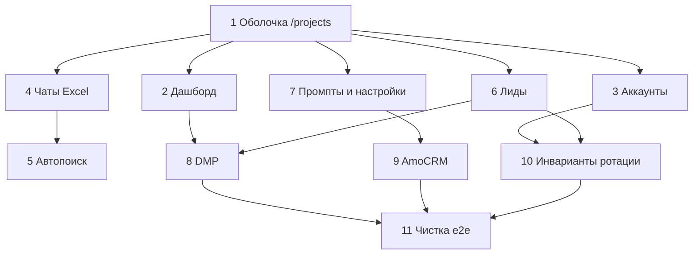

# План v2: `/custom` как пространство решений (вид `/projects`)

> **Это актуальный план.** Предыдущий [CUSTOM_AGENTS_PLAN.md](./CUSTOM_AGENTS_PLAN.md) — справочник по модели данных и backend. Не открывать его как ТЗ на UI.
>
> Как пользоваться: приложите этот файл и напишите `Реализуй Этап N из backlogs/CUSTOM_AGENTS_V2_PLAN.md`.

---

## 0. Зачем v2

Сейчас `/custom` — отдельная Tailwind-админка: английские пункты, горизонтальное меню, синие кнопки, не похоже на продукт. Это ошибка.

**Правило:** не изобретать новый визуальный язык. Копировать уже существующие экраны RSD.

| Что есть в продукте | Как использовать в `/custom` |
|---------------------|------------------------------|
| [`/projects`](https://rsd-ai.ru/projects) — список решений слева, карточка управления справа, кнопка создать | Список автоматизаций (админ видит все, клиент — свою) |
| Сайдбар проекта (`ProjectLayout` + `projectLayout.css`) | Настройка одной автоматизации |
| Дашборд проекта (`projectDashboard.css`) и аналитика агента (`/agents/:id/analytics`) | Дашборд автоматизации: сообщения, лиды, статусы, чаты |
| Карточка агента (`agent-management-card` в `agentsPage.css`) | Блоки «аккаунты / чаты / модули» внутри решения, не отдельный дизайн |

Отдельный путь `/custom` **остаётся** (другая авторизация, массовость, пул аккаунтов). Отдельный UI-кит — нет.

Не делать:

- новые страницы «в стиле bootstrap-admin»;
- телефонию, SashaAI, ИИ-контент-завод;
- биллинг заказчику (расходы несёт компания, в UI только учёт DMP и аккаунтов);
- ВК / Instagram на этом этапе.

---

## 1. Бизнес и границы

Услуга: партизанская лидогенерация в Telegram. В очереди два заказа.

| Клиент | Модули | CRM |
|--------|--------|-----|
| SaaS для SEO-оптимизации сайтов (не «SEO-агентство») | нейрокомментинг, перехват заявок, цифровой след, DMP.one | **без AmoCRM** — лид уходит на `lead_manager_contact` |
| Фулфилмент A2 | то же | **AmoCRM включена** |

Контент-завод и прозвон из `FirstTT.txt` — вне scope. Прогрев лида только Telegram-аккаунтами пула.

После настройки система автономна. Оператор только **подливает аккаунты** и **списки чатов/каналов**.

---

## 2. UX — единственный канон

### 2.1. Вход

`/custom` и `/custom/login` — одна форма (уже без переключателя админ/клиент). Backend сам решает роль.

Визуал как у текущего login `/custom` + токены RSD (`btn-black`, карточка). Не тащить главную навбар-шапку сайта: у `/custom` своя сессия.

### 2.2. Админ после входа = `/projects`

Маршрут: `/custom/admin` (алиас `/custom/admin/dashboard`).

Макет **как** `ProjectsListPage` → `AgentsPageContent`:

```
┌─────────────────────────────────────────────────────────┐
│  Кастомные агенты                    [Новое решение]    │
├────────────────────┬────────────────────────────────────┤
│ карточки           │  agent-management-card             │
│ автоматизаций      │  название, статус, модули,         │
│ (как AgentCard /   │  быстрые цифры, «Открыть»          │
│  ProjectCard)      │                                    │
└────────────────────┴────────────────────────────────────┘
```

- Кнопка **«Новое решение»** сверху — создаёт `CustomAutomation` (короткая форма: название, клиент, индустрия). Без AI-визарда проекта.
- Клик по карточке открывает решение с сайдбаром.
- Отдельные «админские» экраны edit/access не как уникальный дизайн: доступ клиента — блок в **Настройках** решения.

### 2.3. Клиент после входа

Если у логина одна автоматизация — сразу `/custom/automations/:id/dashboard` с сайдбаром. Список слева не нужен.

Админ внутри решения видит тот же сайдбар, плюс ссылку «Все решения».

### 2.4. Сайдбар решения = `ProjectLayout`

Переиспользовать классы из `frontend/src/styles/projectLayout.css` (или тонкий `customLayout.css`, который только импортирует те же правила и меняет пункты меню).

Пункты меню (русски, иконки как в проекте):

| Пункт | Зачем | Скрывать если |
|-------|--------|----------------|
| Дашборд | метрики и воронка | — |
| Аккаунты | пул, залив, класс, профили | — |
| Чаты | Excel, вступление, автопоиск | — |
| Лиды | статусы, диалоги | — |
| Промпты | всё редактируемо, вкл/выкл | — |
| DMP.one | выкуп, стоимость | модуль выключен |
| AmoCRM | oauth, воронка | модуль выключен (SEO SaaS) |
| Настройки | модули, ротация, доступы, контакт менеджера | — |

Не показывать: сайты, база знаний, контент-завод, телефония, ИИ-менеджер проекта.

Дашборд по составу ближе к аналитике агента, чем к маркетинговому лендингу:

- сообщения (оставлено / за 24ч / 7д);
- лиды: перехвачено, в прогреве, квалифицирован, передано, обработано, конверсия, спам;
- аккаунты: всего / active / banned / по классам;
- DMP: куплено контактов, `cost_rub`, CPL;
- лента последних диалогов с лидами (как чаты в аналитике агента).

### 2.5. Что снести во фронте

Удалить или заменить Tailwind-страницы, не копируя их классы:

- `CustomAdminLayout.jsx`, `CustomClientLayout.jsx` — горизонтальное меню;
- все `bg-blue-600` / `min-h-screen bg-gray-50` экраны `/custom/*`;
- английские лейблы Dashboard / Accounts / Logout.

Backend API **не сносить**. Меняется только оболочка и плотность экранов.

---

## 3. Доступ

| Роль | Логин | Что видит |
|------|-------|-----------|
| Админ | `CUSTOM_ADMIN_*` + строка в `custom_admins` | все решения, создание, доступы |
| Клиент | `custom_automation_credentials` | одно решение |

JWT отдельные (`custom_admin` / `custom_automation`). Сессия `/custom` не пускает в `/projects`.

При старте backend сидировать админа из `.env` (уже заложено). Хэш bcrypt в `.env` с `$$`.

---

## 4. Функционал строго по ТЗ

### 4.1. Уже в backend — проверить, не переписывать с нуля

| Модуль | Ожидание | Проверка |
|--------|----------|----------|
| Мониторинг чатов | сообщение «кто делает SEO / нужен фулфилмент» → ЛС с оффером | e2e на одном чате |
| Нейрокомментинг | комментарии в каналах, при уместности рекомендация | e2e |
| Цифровой след | участие в дискуссии, без ротации внутри одного треда | e2e |
| Join из Excel | столбец ссылок, `FloodWait` → пауза 2–5 мин → retry | импорт 20 ссылок |
| Дедуп | 10 аккаунтов в 100 чатах, одно входящее = одна обработка | два listener'а, один `ChatMessage` |
| Автопоиск | тема → LLM-фильтр → вступление | одна задача |
| Классификация | `one_day` / `mid` / `trusted` после залива | zip сессий |
| Массовые профили | аватар+bio по классу | форма |
| Ротация | только публичный риск (комменты, массовые действия) | диалог с лидом не скачет по аккаунтам |
| DMP.one | заказ, webhook/poll, стоимость, выход в TG однодневками | без звонков |
| AmoCRM | per-автоматизация, фулфилмент | SEO — флаг выключен |

Промпты только из БД (`CustomPrompt`), в коде — ключи типов, не тексты офферов.

### 4.2. Классификация аккаунтов

| Класс | Роль |
|-------|------|
| `one_day` | нейрокомментинг, массовый след, DMP-outreach; высокий риск бана |
| `trusted` | перехват заявок и закреплённый диалог с лидом; не ротировать |
| `mid` | был однодневкой, клиент написал в ЛС — этот аккаунт ведёт диалог дальше |

Назначение лиду `assigned_account_id` навсегда для этого диалога. Смена аккаунта в середине разговора запрещена.

Ротация автоматическая для `one_day` на публичных действиях: `round_robin` / `least_used` / `risk_weighted`, дневной лимит.

### 4.3. Чаты

Excel/CSV: один столбец ссылок (`t.me/...`, invite). Все аккаунты пула вступают. Rate limit Telegram → ждать и повторить.

Если 10 аккаунтов сидят в одних 100 чатах: сырой апдейт пишется с `dedup_key` (chat + message_id), unique в БД. Обрабатывает один worker.

Автопоиск — автоматизация пункта «залил Excel»: тема ЦА → поиск → оценка → вступление. Модерация по умолчанию выключена, если оператор хочет полностью автономно.

### 4.4. DMP.one

- Выкуп посетителей сайта заказчика и сайтов конкурентов.
- В UI: купленные контакты, сумма `cost_rub`, CPL, статус заказа.
- Контакт: Telegram-однодневка, не звонок.
- Расход несёт компания — отдельный биллинг клиента не строить.

### 4.5. AmoCRM

Только если `is_amocrm_enabled`. Иначе `lead_manager_contact` (Telegram / email / webhook).

---

## 5. Маршруты после UX-пересборки

```
/custom                          → /custom/login
/custom/login                    → роль

админ:
  /custom/admin                  список решений как /projects
  /custom/admin/new              форма нового решения
  /custom/automations/:id/*      то же приложение, что у клиента

клиент и админ внутри решения:
  .../dashboard
  .../accounts
  .../chats                      импорт + таблица + discovery на этой же странице (вкладки), не отдельный «сайт»
  .../leads
  .../leads/:leadId              диалог как в аналитике агента
  .../prompts
  .../dmp                        если модуль
  .../amocrm                     если модуль
  .../settings                   модули, ротация, доступы, менеджер
```

Старые URL (`/custom/admin/automations`, `/chats/discovery`) — редиректы, чтобы не плодить экраны.

---

## 6. Этапы (по одному промпту)

Каждый этап: не ломать `/projects` и `/agents`; не добавлять Tailwind-админку; не трогать телефонию.

### Этап 1. Оболочка как `/projects`

**Цель:** после логина админ видит список решений в вёрстке `agents-layout` + `agent-management-card`. Клиент попадает в решение с `project-layout` сайдбаром.

**Сделать:**

1. `CustomSolutionsListPage` на CSS `agentsPage.css` / `projectsListPage.css` (карточки, кнопка «Новое решение»).
2. `CustomSolutionLayout` на CSS `projectLayout.css`.
3. Заменить `CustomAdminLayout` / `CustomClientLayout`.
4. Русские пункты меню из §2.4.
5. Логин оставить, без разделения ролей в UI.

**Не делать:** новые метрики, переписывание API.

**Готово когда:** визуально не отличить каркас от `/projects` (другие пункты меню — ок).

### Этап 2. Дашборд как аналитика агента

**Цель:** цифры и воронка, не «пять серых карточек Tailwind».

**Сделать:** страница на `projectDashboard.css` + блоки в духе `agentDetailedAnalytics.css`: сообщения, лиды по статусам, баны, DMP cost, список последних диалогов со ссылкой в чат лида.

**Готово когда:** те же сущности, что в API `GET /automations/:id/dashboard`, выглядят как дашборд проекта/агента.

### Этап 3. Аккаунты (карточка управления)

**Цель:** массовый zip/csv, автоклассификация, массовые профили, классы — в стиле секций `agent-management-card`, не цветные кнопки.

**Сделать:** переверстать `CustomAutomationAccountsPage` на `agentsPage.css` + `createAgent.css` (поля, `btn-black`, `btn-outline`).

**Готово когда:** залив → health/classify без обязательного клика «проверить»; профили по классу.

### Этап 4. Чаты: Excel + join + дедуп

**Цель:** один столбец ссылок; вступление с retry; одно сообщение на N аккаунтов.

**Сделать:**

1. Импорт на той же странице Чаты (не отдельный продукт).
2. Проверить `FloodWait` и `dedup_key` (тест уже есть — дополнить, если дыра).
3. Убрать радужные кнопки Join/Monitor/Neuro как обязательный контур; scheduler остаётся источником правды. Кнопки «сейчас» — `btn-outline`.

**Готово когда:** Excel → pending → joined; дубль апдейта не создаёт второй лид.

### Этап 5. Автопоиск чатов

**Цель:** автоматизация залива Excel.

**Сделать:** вкладка на странице Чаты (не отдельный route в меню). Query, порог, «сразу вступать». `require_approval` по умолчанию **false**.

**Готово когда:** задача находит чаты и создаёт `ChatTarget` без ручного Approve.

### Этап 6. Лиды и диалоги

**Цель:** как CRM проекта / чаты аналитики агента.

**Сделать:** таблица статусов, фильтры, экран переписки. Прогрев и авто-передача уже в backend — не дублировать кнопками, если модуль включён.

**Готово когда:** видно воронку и ход диалога с закреплённым аккаунтом.

### Этап 7. Промпты и настройки

**Цель:** как панель обычного агента: всё меняется в UI, модули вкл/выкл.

**Сделать:**

1. Промпты списками секций (мониторинг, коммент, след, квалификация лида, DMP-outreach).
2. Настройки: флаги модулей, ротация, лимит/день, `lead_manager_contact`, доступы клиента (логин/пароль) — для админа.
3. AmoCRM-пункт меню только при флаге.

**Готово когда:** смена промпта/флага без деплоя влияет на worker.

### Этап 8. DMP.one (учёт расходов)

**Цель:** заказ контактов, таблица купленных, сумма и CPL. Outreach через `one_day`.

**Сделать:** экран в стиле интеграций проекта (`projectIntegrationsPage.css`). Никакой телефонии.

**Готово когда:** в дашборде видны `purchased_count` и `cost_rub`.

### Этап 9. AmoCRM только фулфилмент

**Цель:** подключение и передача лида. Для SEO-решения пункт скрыт.

**Сделать:** UI как интеграции проекта. Проверить sync статусов.

**Готово когда:** фулфилмент-автоматизация создаёт сделку; SEO — нет пункта меню и нет вызовов API.

### Этап 10. Ротация — жёсткие инварианты

**Цель:** автоматическая ротация однодневок; **нет** смены аккаунта внутри диалога с лидом и внутри одного треда дискуссии.

**Сделать:** ревью `rotation_service` + тесты:

- neurocommenting / массовый footprint — ротация есть;
- `assigned_account_id` на лиде не меняется;
- discussion thread lock на аккаунт.

**Готово когда:** тесты падают, если ротация лезет в DM.

### Этап 11. Чистка и e2e двух клиентов

**Сделать:**

1. Удалить мёртвые Tailwind-страницы и неиспользуемые маршруты.
2. Ручной чеклист:
   - SEO SaaS: решение без AmoCRM → аккаунты → Excel чатов → заявка в чате → один лид → `lead_manager_contact`.
   - A2: то же + AmoCRM.
3. Обновить `docs/custom/RUNBOOK.md` под новые URL и вид `/projects`.
4. Не раздувать v1-план новыми «этапами масштаба» в этом релизе.

**Готово когда:** оператор без инструкции «какой цвет кнопки жать» ведёт два решения.

---

## 7. Что не делать в этих этапах

- Прокси-ферма, Kafka, шарды listener'ов (это §17 старого плана, после MVP).
- Kill switch можно одной кнопкой «Пауза» в настройках (`status=paused`) — без отдельного продукта.
- Парсинг лидов + массовые инвайты в канал заказчика из `FirstTT.txt` п.4 — **не в этом релизе**, если не включено отдельным флагом позже.
- Любой новый CSS, который не копирует существующие файлы `/projects` или analytics.

---

## 8. Карта файлов

Переиспользовать:

- `frontend/src/styles/projectLayout.css`
- `frontend/src/styles/projectDashboard.css`
- `frontend/src/styles/agentsPage.css` (карточки, `agent-management-card`)
- `frontend/src/styles/agentDetailedAnalytics.css`
- `frontend/src/styles/projectIntegrationsPage.css`
- `frontend/src/styles/projectCRMPage.css`

Backend не дублировать: `backend/app/router_custom/`, `backend/app/services/custom/`.

Frontend переписать оболочку: `frontend/src/pages/custom/**`, `frontend/src/components/custom/**`.

---

## 9. Зависимости этапов



Этапы 2–7 после этапа 1 можно частично параллелить. Этап 10 не откладывать: без него UX «красивый», а диалоги ломаются.

---

## 10. Критерий продукта

Оператор:

1. Входит на `/custom/login`.
2. Админ создаёт «Новое решение», выдаёт клиенту логин.
3. Заливает zip аккаунтов и Excel чатов.
4. Включает нужные модули в настройках.
5. Дальше система сама: join, мониторинг, комменты, след, прогрев, передача (контакт или Amo).
6. Дашборд показывает сообщения, лиды по статусам, купленные DMP и их стоимость.

Ни телефонии, ни контент-завода, ни второго визуального языка.

---

*Версия 2.0 · 2026-08-24*
