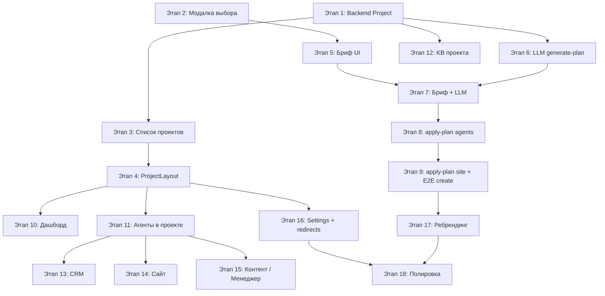

# План: Портал цифровизации бизнеса (сущность «Проект»)

> **Как пользоваться планом:** откройте чат в ИИ-редакторе, приложите этот файл целиком и напишите:  
> `Реализуй Этап N из backlogs/PROJECT_PORTAL_PLAN.md`  
> Каждый этап рассчитан на **один промпт** — самодостаточный инкремент без «всё сразу».

---

## 1. Видение продукта

### 1.1. Смена позиционирования

| Было | Станет |
|------|--------|
| «No-code платформа для ИИ-агентов» | «Портал цифровизации бизнеса» |
| Главная сущность — агент | Главная сущность — **Проект** (бизнес / отдел) |
| Разрозненные разделы: `/agents`, `/websites`, CRM в агенте | Единая оболочка проекта с боковой навигацией |

**Важно:** runtime агентов (`TemplateRuntimeService`, каналы, шаблоны, биллинг per-agent) **не переписываем**. Проект — организационный и UX-слой поверх существующей архитектуры.

### 1.2. Что такое Проект

**Проект** — контейнер цифровизации малого/среднего бизнеса или отдела в крупной компании.

Внутри проекта живут:

| Раздел | Содержимое | Текущее состояние в коде |
|--------|------------|--------------------------|
| Дашборд | Сводка: агенты, диалоги, лиды, сайт | Нет единого экрана |
| Агенты | ИИ-агенты проекта | `agentsPage.jsx`, `createAgent.jsx` |
| База знаний | Общие документы для всех агентов | Сейчас `AgentDocument` per-agent |
| CRM | Заявки, записи, сделки, контакты | `crm_admin` booking, `sales_manager` contacts |
| Сайт | AI-конструктор | `Website` model, `agent_id` optional |
| Контент-завод | Pipeline публикаций | `content_factory` template, worker |
| ИИ-менеджер | Телефония / входящие | `ai_manager` template (в разработке) |
| Настройки | Название, отрасль, бриф | Новое |

### 1.3. Что такое ИИ-агент (без изменений)

Агент остаётся отдельной сущностью с `template_type` (`qa`, `crm_admin`, `sales_manager`, `content_factory`, `ai_manager`), своими каналами и биллингом. Проект **владеет** агентами через `project_id`, но не меняет их внутреннюю логику.

### 1.4. Что остаётся без изменений (100% сохранение функционала)

| Функция | URL | Примечание |
|---------|-----|------------|
| Создание агента | `/create-agent` | + принимает `?projectId=` для привязки к проекту |
| Редактирование агента | `/agents/:id/edit` | Без изменений, доступно из проекта |
| Аналитика агента | `/agents/:id/analytics` | Без изменений |
| Конструктор сайта | `/websites/:id/edit` | Без изменений — полный редактор |
| Превью сайта | `/preview/:id` | Без изменений |
| Публичный сайт | `/w/:slug` | Без изменений |
| Все API агентов | `/api/agents/*` | Без изменений, добавляется опциональный `project_id` |
| Все API сайтов | `/api/v1/websites/*` | + поле `project_id` в request/response |
| Старый список агентов | `/agents` | Legacy-роут, редиректит на `/projects` или последний проект |

---

## 2. UX-логика

### 2.1. Точки входа «Создать»

Все существующие CTA «Создать агента» / «+ Новый агент» / Navbar «Создать агента» / Hero на лендинге — **остаются визуально**, но при клике (для авторизованных) открывают **модальное окно выбора**:

```
┌─────────────────────────────────────────┐
│  Что вы хотите создать?                 │
│                                         │
│  ┌──────────────┐  ┌──────────────┐     │
│  │  🤖 ИИ-агент │  │  🏢 Проект   │     │
│  └──────────────┘  └──────────────┘     │
│                                         │
│  ИИ-агент                               │
│  Один специализированный помощник:      │
│  поддержка, продажи, администратор.     │
│  Подключается к мессенджерам и сайту.   │
│                                         │
│  Проект                                   │
│  Цифровизация бизнеса целиком: набор    │
│  агентов, CRM, сайт, база знаний и      │
│  дашборд в одном пространстве.          │
│                                         │
│              [ Отмена ]                 │
└─────────────────────────────────────────┘
```

**Иконки в UI (без эмодзи):** Использовать `Bot` для ИИ-агента, `Briefcase` или `LayoutTemplate` для Проекта.

**Поведение:**
- **ИИ-агент** → текущий флоу `/create-agent` без изменений.
- **Проект** → `/projects/create` (AI-first бриф).
- Неавторизованный пользователь → `/auth` (как сейчас), после логина можно вернуть на выбор через `?intent=create`.

**Файлы с CTA (обновить в Этапе 2):**
- `frontend/src/pages/Main.jsx` — hero, footer CTA
- `frontend/src/pages/agentsPage.jsx` — «+ Новый агент»
- `frontend/src/components/Navbar.jsx` — «Создать агента»
- `frontend/src/pages/PriceList.jsx` — кнопки тарифов

### 2.2. AI-first создание проекта

Пользователь **не заполняет десятки полей**. Он отвечает на короткий бриф (5–8 вопросов), LLM возвращает готовый план, пользователь подтверждает — система создаёт всё.

#### Бриф (поля формы)

| Поле | Тип | Обязательно | Пример |
|------|-----|-------------|--------|
| Название бизнеса / отдела | text | да | «Салон красоты Люмьер» |
| Отрасль | select + «другое» | да | beauty_salon, retail, b2b_services, … |
| Что автоматизируем | checkboxes | да | поддержка, запись, продажи, контент, сайт |
| Каналы связи | checkboxes | нет | telegram, whatsapp, сайт, телефон |
| Краткое описание | textarea 300–800 символов | да | «Запись на услуги, ответы по прайсу…» |
| Тон общения | select | нет | дружелюбный / деловой / премиум |
| Город / регион | text | нет | «Москва» |

#### UX-флоу

```
/projects/create
    → Шаг 1: Бриф (форма)
    → Шаг 2: «Генерируем решение…» (skeleton + прогресс)
    → Шаг 3: Превью плана (редактируемые карточки)
    → Шаг 4: «Запустить проект» → создание сущностей
    → Редирект на /projects/:id/dashboard
```

#### Превью плана (Шаг 3)

Карточки с возможностью убрать/добавить до применения:

- **Проект:** название, описание, отрасль
- **Агенты (N шт.):** имя роли, `template_type`, system_prompt (свёрнутый + «развернуть»), welcome_message
- **Сайт:** да/нет, заголовок, slug-предложение
- **CRM:** предзаполненный `template_config` для crm_admin (услуги-заглушки — опционально)
- **База знаний:** список «рекомендуемых документов для загрузки» (текст от LLM, файлы пользователь грузит позже)

Пользователь может **снять галочку** с агента или сайта до применения.

### 2.3. Навигация внутри проекта

Отдельный layout **`ProjectLayout`** — без Footer лендинга, компактный top-bar + **иконки слева**.

```
┌──────────────────────────────────────────────────┐
│ [← Проекты]  Салон Люмьер          [Профиль]   │
├────┬─────────────────────────────────────────────┤
│ 📊 │                                             │
│ 🤖 │         Контент раздела                     │
│ 📚 │                                             │
│ 👥 │                                             │
│ 🌐 │                                             │
│ 📹 │                                             │
│ 📞 │                                             │
│ ⚙️ │                                             │
└────┴─────────────────────────────────────────────┘
```

*(Эмодзи в схеме — для наглядности в документации. В реальном UI использовать иконки из библиотеки, см. таблицу ниже.)*

| Иконка (в плане) | Раздел | Route | MVP | Реальная иконка (пример) |
|------------------|--------|-------|-----|------------------------|
| 📊 | Дашборд | `/projects/:id` | да | `LayoutDashboard` (Lucide) |
| 🤖 | Агенты | `/projects/:id/agents` | да | `Bot` (Lucide) |
| 📚 | База знаний | `/projects/:id/knowledge` | да | `BookOpen` (Lucide) |
| 👥 | CRM | `/projects/:id/crm` | да | `Users` (Lucide) |
| 🌐 | Сайт | `/projects/:id/website` | да | `Globe` (Lucide) |
| 📹 | Контент-завод | `/projects/:id/content` | если есть агент | `Video` (Lucide) |
| 📞 | ИИ-менеджер | `/projects/:id/manager` | заглушка | `Phone` (Lucide) |
| ⚙️ | Настройки | `/projects/:id/settings` | да | `Settings` (Lucide) |

На мобиле — bottom bar или hamburger с теми же пунктами.

**Активный проект:** после первого входа редирект на последний открытый проект (`localStorage: lastProjectId`) или список проектов.

### 2.4. Список проектов

`/projects` — карточки проектов пользователя:

- название, отрасль, дата создания
- мини-статус: N агентов, сайт опубликован / черновик
- кнопка «+ Новый проект» → `/projects/create`
- клик по карточке → `/projects/:id`

### 2.5. Обратная совместимость URL

| Старый URL | Поведение |
|------------|-----------|
| `/agents` | Редирект на `/projects` или `/projects/:defaultId/agents` |
| `/agents/:id/analytics` | ✅ Без изменений — прямая ссылка работает |
| `/agents/:id/edit` | ✅ Без изменений — редактирование агента |
| `/create-agent` | ✅ Без изменений (прямой deep link), + поддержка `?projectId=` |
| `/websites/:id/edit` | ✅ Без изменений — конструктор сайта (полный редактор) |
| `/w/:slug` | ✅ Без изменений — публичный сайт |
| `/preview/:id` | ✅ Без изменений — превью сайта |

**Примечание:** Раздел `/projects/:id/website` — это **дашборд сайта** (статус + ссылки), а не конструктор. Конструктор остаётся по `/websites/:id/edit`.

---

## 3. Бизнес-логика

### 3.1. Модель данных `Project`

```python
# backend/app/alembic/models.py (новая таблица)

class Project(Base):
    id: int PK
    user_id: FK → users.id (CASCADE)
    name: str(200)          # «Салон Люмьер»
    slug: str(80) unique per user  # lumier-salon
    industry: str(64)       # beauty_salon | retail | ...
    description: text       # из брифа
    brief_json: JSONB       # исходный бриф
    ai_plan_json: JSONB     # последний утверждённый план от LLM
    status: str             # draft | active | archived
    is_default: bool        # миграция: один default на пользователя
    created_at, updated_at
```

**Связи (добавить nullable FK, не ломая старые записи):**

```python
Agent.project_id: FK → projects.id (SET NULL), nullable, index
Website.project_id: FK → projects.id (SET NULL), nullable, index
```

### 3.2. Миграция существующих пользователей

При деплое миграции:

1. Для каждого `user` без проектов создать `Project(name="Мой бизнес", is_default=True, status="active")`.
2. Все его `agents` без `project_id` → привязать к default project.
3. Все его `websites` без `project_id` → привязать к default project.

Пользователь не замечает поломки: заходит в «Мой бизнес» и видит всё как раньше.

### 3.3. API проектов

Префикс: `/api/projects`

| Method | Path | Описание |
|--------|------|----------|
| GET | `/` | Список проектов текущего user |
| POST | `/` | Создать пустой проект (ручной, без AI) |
| GET | `/{id}` | Детали + счётчики (agents_count, website_status) |
| PATCH | `/{id}` | Обновить name, description, industry |
| DELETE | `/{id}` | Архивация (не удалять агентов) |
| POST | `/ai/generate-plan` | Бриф → LLM → JSON план (без создания сущностей) |
| POST | `/ai/apply-plan` | Утверждённый план → создание project + agents + website |

**Права:** только владелец `user_id`. Проверка как в `_find_agent_with_access`.

### 3.4. LLM-контракт (generate-plan)

**Вход:** `ProjectBriefRequest` (поля брифа из §2.2).

**Выход:** строгий JSON (валидировать Pydantic + retry при невалидном JSON):

```json
{
  "project": {
    "name": "Салон Люмьер",
    "description": "...",
    "industry": "beauty_salon"
  },
  "agents": [
    {
      "suggested_name": "Администратор салона",
      "template_type": "crm_admin",
      "system_prompt": "...",
      "welcome_message": "...",
      "template_config": { }
    },
    {
      "suggested_name": "Консультант",
      "template_type": "qa",
      "system_prompt": "...",
      "welcome_message": "..."
    }
  ],
  "website": {
    "enabled": true,
    "title": "Салон красоты Люмьер",
    "suggested_slug": "lumier-salon",
    "generation_prompt": "..."
  },
  "knowledge_recommendations": [
    "Прайс-лист услуг",
    "Регламент записи и отмены",
    "FAQ для клиентов"
  ],
  "crm_hints": {
    "booking_backend": "crm",
    "suggested_services": ["Стрижка", "Окрашивание"]
  }
}
```

**Правила для промпта LLM (зашить в `backend/app/prompts/project_plan.py`):**

- Разрешённые `template_type`: только из списка активных в продукте (`qa`, `crm_admin`, `sales_manager`; `content_factory` / `ai_manager` — только если `settings.*_ENABLED`).
- Не более 4 агентов в одном плане.
- `system_prompt` на русском, 500–2000 символов, без плейсхолдеров `{{}}`.
- Если в брифе нет «продажи» — не предлагать `sales_manager`.
- Если нет «запись/администратор» — не предлагать `crm_admin`.
- `template_config` для `crm_admin` — минимальный v2-контракт (см. тест `test_create_empty_agent_crm_admin_default_v2_config`).

**Технология:** расширить `backend/app/services/ai_authoring.py` или новый `project_plan_service.py`, модель `deepseek-chat`, `response_format` / парсинг JSON с 1 retry.

### 3.5. apply-plan (создание сущностей)

Оркестратор `ProjectProvisioningService`:

1. Создать `Project` (status=`active`).
2. Для каждого агента из плана → вызвать ту же логику, что `POST /api/agents` (`create_empty_agent`): `template_type`, `system_prompt`, `template_config`, `project_id`, billing fields.
3. Сохранить `welcome_message` в `template_config` или отдельное поле агента (как сейчас принято в шаблоне).
4. Если `website.enabled` → вызвать существующий `POST /api/v1/websites/generate/create-and-generate` с дополнительным `project_id` в payload.
5. Записать `ai_plan_json` в проект.
6. Вернуть `{ project_id, agent_ids[], website_id? }`.

**Переиспользование существующего кода:**
- Создание агента — вызвать `create_empty_agent` из `router_agents/core.py`
- Создание сайта — вызвать `create_and_generate_website` из `router_websites/router.py`

**Транзакция:** project + agents в одной DB-транзакции; website generation — background task (как сейчас).

**Идемпотентность:** `apply-plan` принимает `plan_id` или hash плана; повторный клик не дублирует (409 или noop).

### 3.6. База знаний проекта

**MVP (Этап 12):** таблица `project_documents` — зеркало `agent_documents`, но с `project_id`.

**Примечание:** Существующие `AgentDocument` остаются без изменений. Агенты используют свои документы + могут читать документы проекта (опционально, Этап 12b).

| Поле | Назначение |
|------|------------|
| project_id | FK |
| file_name, content_hash, status | как у AgentDocument |
| embedding_* | те же поля для Qdrant |

**Индексация:** отдельный `knowledge_scope_id` для проекта = `project.id` (или `project.knowledge_scope_id`).

**Чтение агентами (Этап 11b, опционально в том же этапе):** в RAG-запросе агента с `project_id` объединять чанки: `agent scope` + `project scope`. Минимальное изменение в слое поиска, **не** в `TemplateRuntimeService` — только в функции получения контекста (например `retrieve_knowledge_chunks`).

**AI-first:** при создании проекта LLM не загружает файлы — только рекомендует список; UI показывает чеклист «Загрузите прайс» на дашборде.

### 3.7. CRM в контексте проекта

Агрегация без новой CRM-БД:

| Источник | Данные в разделе CRM |
|----------|----------------------|
| `crm_admin` агенты проекта | Записи / appointments, услуги |
| `sales_manager` агенты | Импортированные контакты, стадии |
| `AiMopLead` | Если есть ai_manager агент |

UI: табы «Заявки», «Контакты», «Сделки» — данные через существующие API агентов с фильтром `project_id`.

### 3.8. Дашборд

Виджеты (данные из существующих endpoints):

- Активные агенты / всего
- Диалоги за 7 дней (сумма по агентам проекта)
- Новые лиды / записи за период
- Статус сайта (draft / published / generating) + ссылка «Редактировать» (→ `/websites/:id/edit`) или кнопка «Создать сайт»
- Чеклист онбординга: «Подключите Telegram», «Загрузите прайс», «Опубликуйте сайт»

### 3.9. Биллинг

**Без изменений на первых этапах:** оплата остаётся per-agent (`maintenance_paid_until`, шаблонные цены). В UI проекта показывать суммарный статус: «2 агента на платном тарифе».

Project-level billing — вне scope этого плана (future).

---

## 4. Технические соглашения для всех этапов

### 4.1. Frontend

- React, существующие паттерны: `services/`, `hooks/`, `context/`, CSS рядом в `styles/`.
- Константы маршрутов — `frontend/src/config/constants.js` → блок `NAVIGATION_ROUTES.PROJECTS_*`:
  ```javascript
  PROJECTS_LIST: '/projects',
  PROJECT_CREATE: '/projects/create',
  PROJECT_DETAIL: (id) => `/projects/${id}`,
  PROJECT_AGENTS: (id) => `/projects/${id}/agents`,
  PROJECT_KNOWLEDGE: (id) => `/projects/${id}/knowledge`,
  PROJECT_CRM: (id) => `/projects/${id}/crm`,
  PROJECT_WEBSITE: (id) => `/projects/${id}/website`,
  PROJECT_CONTENT: (id) => `/projects/${id}/content`,
  PROJECT_MANAGER: (id) => `/projects/${id}/manager`,
  PROJECT_SETTINGS: (id) => `/projects/${id}/settings`,
  ```
- Новые страницы: `frontend/src/pages/projects/`.
- Layout: `frontend/src/components/projects/ProjectLayout.jsx`.
- Модалка: `frontend/src/components/CreateChoiceModal.jsx`.
- Сервис: `frontend/src/services/projectService.js`.
- **SEO:** В `seo.js` добавить `/projects/*` в `PRIVATE_PREFIXES`.

### 4.2. Backend

- Router: `backend/app/router_projects/router.py`, подключить в `server.py`.
- DAO: `backend/app/dao/project_dao.py`.
- Schemas: `backend/app/router_projects/schemas.py`.
- Alembic-миграция на каждый этап с изменением схемы.
- Тесты: `backend/app/tests/test_projects_router.py` — минимум happy path + auth.

### 4.3. Стиль UI

- Переиспользовать `.btn`, `.btn-black`, карточки из `agents-page` / `main.css`.
- Sidebar: 56–64px иконки, tooltip при hover, активный пункт — accent border слева.
- Не ломать `MainLayout` для публичных страниц.
- **Иконки:** использовать библиотеку (например, Lucide, Heroicons или встроенные SVG), **строго без эмодзи**. В плане эмодзи используются только для наглядности в документации — в коде заменять на иконки.

### 4.4. Feature flags

Разделы «Контент» / «ИИ-менеджер» скрывать, если:
- нет агента соответствующего `template_type` в проекте, **или**
- флаг в settings выключен (`CONTENT_FACTORY_ENABLED`, `AI_MOP_ENABLED`).

---

## 5. Этапы реализации

---

### Этап 1. Backend: модель Project и миграция данных

**Цель:** сущность Project в БД, API CRUD, привязка существующих агентов/сайтов.

**Сделать:**

1. Alembic: таблица `projects`, колонки `agents.project_id`, `websites.project_id` (nullable, index).
2. Модель `Project` в `models.py`, relationships.
3. `ProjectDAO`: list_by_user, get_by_id, create, update, archive.
4. Router `/api/projects`: GET `/`, POST `/`, GET `/{id}`, PATCH `/{id}`, DELETE `/{id}` (archive).
5. Data migration: default project per user, backfill FK.
6. При создании нового агента/сайта без `project_id` — автоматически класть в default project пользователя.
7. Тесты: list, create, access denied для чужого project.

**Не делать:** UI, LLM, sidebar.

**Критерий готовности:** `curl` / pytest — CRUD работает; у старых пользователей есть default project с привязанными агентами.

---

### Этап 2. Frontend: модальное окно «ИИ-агент / Проект»

**Цель:** единая точка выбора при всех CTA «Создать».

**Сделать:**

1. Компонент `CreateChoiceModal.jsx` + стили (см. §2.1).
2. Хук `useCreateChoice()` — open/close, navigate callbacks.
3. Подключить модалку в: `Main.jsx`, `agentsPage.jsx`, `Navbar.jsx`, `PriceList.jsx`.
4. «ИИ-агент» → `NAVIGATION_ROUTES.CREATE_AGENT`.
5. «Проект» → `NAVIGATION_ROUTES.PROJECT_CREATE` (временно заглушка-страница «Скоро» или пустой `/projects/create`).
6. Добавить константы маршрутов проектов в `constants.js` (заглушки).

**Не делать:** полноценный бриф, backend LLM.

**Критерий готовности:** все кнопки создания открывают модалку; выбор агента ведёт на старый флоу.

---

### Этап 3. Frontend: список проектов и базовый роутинг

**Цель:** `/projects` как домашняя точка для авторизованных.

**Сделать:**

1. `projectService.js` — вызовы API из Этапа 1.
2. Страница `ProjectsListPage.jsx` — карточки, empty state, «+ Новый проект».
3. Роуты в `App.jsx`: `/projects`, заглушка `/projects/:projectId` (пока redirect на list или simple detail).
4. После логина (опционально в `AuthProvider` или Navbar): если есть проекты — ссылка «Мои проекты» в меню профиля.
5. `localStorage` ключ `rsd_last_project_id`.

**Не делать:** sidebar, dashboard widgets.

**Критерий готовности:** пользователь видит свои проекты, включая мигрированный «Мой бизнес».

---

### Этап 4. Frontend: ProjectLayout и боковая навигация

**Цель:** оболочка проекта с иконками слева и вложенными роутами.

**Сделать:**

1. `ProjectLayout.jsx` — top bar (название проекта, назад к списку), sidebar с 8 пунктами (§2.3).
2. Вложенные роуты в `App.jsx`:
   - `/projects/:projectId` → Dashboard placeholder
   - `/projects/:projectId/agents`
   - `/projects/:projectId/knowledge`
   - `/projects/:projectId/crm`
   - `/projects/:projectId/website`
   - `/projects/:projectId/content`
   - `/projects/:projectId/manager`
   - `/projects/:projectId/settings`
3. Placeholder-страницы разделов с заголовком и текстом «Раздел в разработке».
4. Скрытие пунктов content/manager по feature flag / наличию агентов (пока можно скрывать всегда).
5. Адаптив: sidebar → drawer на `<768px`.
6. Сохранение `lastProjectId` при входе в проект.

**Примечание по разделу «Сайт»:**
- `/projects/:id/website` показывает: статус сайта (draft/published/generating), кнопку «Редактировать» (→ `/websites/:id/edit`), или кнопку «Создать сайт».
- Конструктор остаётся по `/websites/:id/edit` — не дублируем его функционал.

**Не делать:** наполнение разделов данными.

**Критерий готовности:** навигация между разделами работает, URL стабильны, layout не использует Footer лендинга.

---

### Этап 5. Frontend: AI-бриф — форма создания проекта

**Цель:** UX Шаг 1–2 (бриф + loading) без реального LLM.

**Сделать:**

1. `ProjectCreatePage.jsx` — многошаговый wizard (step: brief | generating | preview | applying).
2. Форма брифа (§2.2): валидация, industry select (переиспользовать `CRM_DOMAIN_OPTIONS` / аналог из `createAgent.jsx`).
3. Шаг generating — skeleton UI, пока **mock** с `setTimeout` 2с → переход на preview с фикстурным планом (JSON в файле `frontend/src/mocks/projectPlanFixture.js`).
4. Шаг preview — карточки агентов/сайта с чекбоксами включения (§2.2).
5. Кнопка «Назад» / «Далее» / «Запустить проект» (на mock — toast «будет в Этапе 7»).

**Не делать:** backend LLM.

**Критерий готовности:** полный UX-флоу на фикстуре, форма валидируется, preview редактируемый.

---

### Этап 6. Backend: LLM generate-plan

**Цель:** реальный AI-ответ по брифу.

**Сделать:**

1. `ProjectBriefRequest`, `ProjectPlanResponse` Pydantic schemas.
2. `backend/app/prompts/project_plan.py` — system/user промпты.
3. `project_plan_service.py` — вызов LLM, JSON parse, retry, валидация.
4. `POST /api/projects/ai/generate-plan` — без side effects в БД.
5. Rate limit (как у `improve_prompt`).
6. Тесты с mocked LLM: валидный JSON, invalid retry, запрещённый template_type отфильтрован.

**Не делать:** создание агентов, frontend подключение (можно минимально).

**Критерий готовности:** endpoint возвращает валидный план по брифу.

---

### Этап 7. Frontend + Backend: подключение generate-plan к wizard

**Цель:** Шаг 2–3 wizard используют реальный API.

**Сделать:**

1. `projectService.generatePlan(brief)` → вызов API.
2. Убрать mock (кроме dev fallback при ошибке сети).
3. Обработка ошибок: понятные сообщения, «Попробовать снова».
4. Preview рендерит реальный ответ LLM; редактирование `project.name`, снятие агентов с галочки.
5. Логирование времени генерации в UI («Собрано за N сек»).

**Не делать:** apply-plan / создание сущностей.

**Критерий готовности:** бриф → реальный LLM → preview; в БД ничего не создаётся до apply.

---

### Этап 8. Backend: apply-plan — создание проекта и агентов

**Цель:** оркестрация создания из утверждённого плана.

**Сделать:**

1. `ProjectProvisioningService` (§3.5).
2. `POST /api/projects/ai/apply-plan` — принимает brief + отредактированный plan.
3. Переиспользовать внутренние функции из `router_agents` (`create_empty_agent` logic) — вынести в shared helper если нужно.
4. Привязка `project_id` всем созданным агентам.
5. Идемпотентность: client-generated `idempotency_key` в запросе.
6. Тесты: 2 агента создаются, project в БД, billing fields корректны.

**Не делать:** website auto-create (следующий этап), frontend apply.

**Критерий готовности:** apply-plan через API создаёт project + agents.

---

### Этап 9. Backend + Frontend: apply-plan — сайт и завершение wizard

**Цель:** end-to-end создание проекта из UI.

**Сделать:**

1. Расширить `apply-plan`: если website.enabled — создать website через существующий `create-and-generate` flow, `project_id`, `agent_id` = primary agent.
2. Frontend: кнопка «Запустить проект» → `applyPlan` → loading → redirect `/projects/:id`.
3. Онбординг-тост на дашборде: «Проект создан! Подключите мессенджер в разделе Агенты».
4. Обработка частичных ошибок (агенты созданы, сайт failed — показать warning с retry).

**Критерий готовности:** пользователь проходит бриф → получает рабочий проект с агентами и (опционально) генерирующимся сайтом.

---

### Этап 10. Frontend: дашборд проекта

**Цель:** содержательный `/projects/:id`.

**Сделать:**

1. `ProjectDashboardPage.jsx` — виджеты (§3.8).
2. Backend: `GET /api/projects/{id}/summary` — агрегаты (agents_count, active_agents, website_status, dialogs_7d если есть API, onboarding_checklist).
3. Чеклист онбординга с deep links в разделы.
4. Быстрые действия: «Добавить агента», «Загрузить документ», «Открыть сайт».

**Критерий готовности:** дашборд показывает реальные данные проекта.

---

### Этап 11. Раздел «Агенты» внутри проекта

**Цель:** управление агентами в контексте project_id.

**Сделать:**

1. `ProjectAgentsPage.jsx` — адаптация логики из `agentsPage.jsx`: фильтр `project_id`, кнопка «+ Агент» → модалка (только агент, без выбора проекта) → create-agent с query `?projectId=`.
2. Backend: `GET /api/agents/allBy_tgID` (или новый endpoint) — опциональный filter `project_id`; при создании агента принимать `project_id`.
3. `createAgent.jsx` — читать `projectId` из query, передавать в API, после сохранения redirect в `/projects/:id/agents`.
4. Ссылки на аналитику агента — без изменений (`/agents/:id/analytics`).

**Не делать:** переписывать agentsPage глобально.

**Критерий готовности:** в проекте видны только его агенты; создание привязывает к проекту.

---

### Этап 12. База знаний проекта

**Цель:** общие документы на уровне проекта.

**Сделать:**

1. Таблица `project_documents` (зеркало `agent_documents`).
2. API: upload, list, delete, reindex для project.
3. `ProjectKnowledgePage.jsx` — список файлов, upload, статусы indexing.
4. RAG: при поиске для агента с `project_id` — merge chunks agent + project (минимальное изменение в retrieval layer).
5. На дашборде — блок «Рекомендуем загрузить» из `ai_plan_json.knowledge_recommendations`.

**Критерий готовности:** документ загружен в проект — все агенты проекта видят его в RAG.

---

### Этап 13. Раздел CRM проекта

**Цель:** единый экран заявок и контактов.

**Сделать:**

1. `GET /api/projects/{id}/crm/summary` — агрегация из booking/sales APIs по агентам проекта.
2. `ProjectCrmPage.jsx` — табы: Заявки (crm_admin), Контакты (sales_manager), лиды AiMop (если есть).
3. Переиспользовать существующие компоненты/таблицы где возможно.
4. Empty states: «Добавьте ИИ Администратора» с CTA.

**Критерий готовности:** CRM-данные всех агентов проекта на одном экране.

---

### Этап 14. Раздел «Сайт» проекта

**Цель:** управление сайтом из проекта.

**Сделать:**

1. `ProjectWebsitePage.jsx` — статус сайта проекта (primary website: последний или с флагом).
2. Backend: `GET /api/projects/{id}/website` — основной сайт; при отсутствии — CTA создать.
3. Кнопки: «Редактировать» → `/websites/:id/edit`, «Создать сайт» → с привязкой project_id + выбор агента.
4. Показ generation_status, ссылка на публичный URL.

**Критерий готовности:** сайт проекта управляется без выхода из ProjectLayout (edit открывается в том же tab или новом — на усмотрение, но возврат понятен).

---

### Этап 15. Разделы «Контент-завод» и «ИИ-менеджер»

**Цель:** завершить sidebar для всех обещанных модулей.

**Сделать:**

1. `ProjectContentPage.jsx` — если есть `content_factory` агент: статус jobs, ссылка на настройки агента / pipeline UI (минимальный read-only dashboard из существующих API).
2. `ProjectManagerPage.jsx` — заглушка с описанием + ссылка на создание ai_manager агента; если `AI_MOP_ENABLED` и агент есть — виджеты из ManagementPortal aiMop (только для владельца проекта, не admin portal).
3. Sidebar: показывать пункты только при наличии соответствующих агентов.

**Критерий готовности:** все пункты sidebar либо функциональны, либо честная заглушка с CTA.

---

### Этап 16. Настройки проекта и редиректы legacy URL

**Цель:** завершение оболочки и миграция навигации.

**Сделать:**

1. `ProjectSettingsPage.jsx` — имя, описание, отрасль, архивация проекта.
2. Редирект `/agents` → `/projects/:lastProjectId/agents` (или `/projects` если нет id).
3. Navbar: для авторизованных «Агенты» → «Проекты» (или оба пункта).
4. Обновить `seo.js` PRIVATE_PREFIXES для `/projects/*`.
5. `create-agent` без projectId → default project (backend уже из Этапа 1).

**Критерий готовности:** старые закладки работают; настройки проекта сохраняются.

---

### Этап 17. Ребрендинг: лендинг, документация, SEO

**Цель:** внешнее позиционирование «Портал цифровизации».

**Сделать:**

1. `Main.jsx` — hero, VALUE_HIGHLIGHTS, CTA: «Создать проект» (модалка), вторичный «Создать агента».
2. `seo.js` — уже частично обновлён; синхронизировать pricing/docs routes descriptions.
3. `DocumentationPage.jsx` — раздел «Создание проекта», обновить «Создание агента».
4. `frontend/public/llms.txt`, `robots.txt` — добавить `/projects` в private/disallow.
5. `index.html` — meta title/description если дублируются.

**Не делать:** backend.

**Критерий готовности:** лендинг продаёт портал, не только агента.

---

### Этап 18. Полировка, тесты E2E, edge cases

**Цель:** production-ready качество.

**Сделать:**

1. E2E сценарий (manual checklist в PR): регистрация → create project → dashboard → upload KB → open CRM.
2. Edge cases:
   - пользователь без проектов (не должно быть после миграции)
   - архивированный проект — 404 в layout
   - apply-plan timeout — partial state recovery message
   - LLM вернул 5 агентов — обрезать до 4 с warning
3. Loading/error boundaries в ProjectLayout.
4. i18n: все строки на русском, единый тон.
5. Документировать API в `DocumentationPage` или openapi description.

**Критерий готовности:** checklist пройден; нет критичных регрессий в старом create-agent флоу.

---

## 6. Зависимости этапов



**Параллелить можно:** Этап 2 параллельно с 1; Этап 17 параллельно с 12–15.

---

## 7. Вне scope (осознанно отложено)

- Тарификация на уровне проекта (подписка «Бизнес»).
- Совместный доступ к проекту (несколько пользователей, роли).
- White-label / кастомный домен портала.
- Полная замена `agentsPage` — она остаётся как legacy route с редиректом.
- Изменение `TemplateRuntimeService`, каналов, шаблонов агентов.
- Перенос `ManagementPortal` (admin) в пользовательский UI.

---

## 8. Чеклист для промпта «Реализуй Этап N»

При запуске этапа ИИ должен:

1. Прочитать этот файл и секцию **Этап N** целиком.
2. Не реализовывать этапы N+1.
3. Следовать §4 (соглашения).
4. Добавить/обновить тесты для backend-изменений.
5. Не ломать существующие тесты и create-agent флоу.
6. В конце кратко перечислить: что сделано, как проверить, что осталось на следующий этап.

---

*Версия плана: 1.0 · Дата: 2026-06-21*


Что сделать на VPS прямо сейчас
Два шага: сначала экстренно закрыть (2 мин), потом задеплоить фикс из репозитория.

Шаг 1. Экстренная блокировка (сделай первым делом)
Зайди на VPS по SSH и выполни:

# Узнать интерфейс (обычно eth0 или ens3)
ip route get 1.1.1.1 | awk '{for(i=1;i<=NF;i++) if($i=="dev") print $(i+1)}'
Подставь интерфейс (допустим eth0):

IFACE=eth0
for PORT in 6333 6334 8000 8001 8002 8100 8200 8090; do
  iptables -I DOCKER-USER -i $IFACE -p tcp --dport $PORT -j DROP
done
iptables -A DOCKER-USER -j RETURN
Сохранить правила (чтобы пережили перезагрузку):

apt install -y iptables-persistent
netfilter-persistent save
Проверка с Windows — все должны зависнуть/отказать:

curl -sS -m 5 http://195.133.26.134:6333/collections
curl -sS -m 5 http://195.133.26.134:8000/docs
curl -sS -m 5 http://195.133.26.134:8002/health
curl -sS -m 5 http://195.133.26.134:8100/health
curl -sS -m 5 http://195.133.26.134:8200/health
Сайт https://rsd-ai.ru при этом должен работать — блокируются только прямые порты на IP.

Шаг 2. Постоянный фикс (после git pull)
На VPS в папке проекта:

cd /path/to/rsd   # твой путь к проекту
git pull
# Сгенерируй ключ для Qdrant (если ещё нет в .env)
openssl rand -hex 32
Добавь в .env на VPS:

ENVIRONMENT=production
QDRANT_API_KEY=<сгенерированный_ключ>
Тот же ключ уже подхватится backend'ом (QDRANT_API_KEY в settings).

Пересоздай контейнеры:

docker compose up -d
Проверь, что порты не слушают снаружи:

ss -tlnp | grep -E '6333|8000|8001|8002|8100|8200'
Должны остаться только 80 и 443 (frontend/nginx). Внутренние сервисы — только в docker-сети.

Повтори curl с Windows — всё ещё должно быть закрыто.

Что изменено в репозитории
Файл	Изменение
docker-compose.yml
Убраны ports у backend, bot, telephony, qdrant — доступ только через nginx/docker-сеть
docker-compose.yml
Qdrant: QDRANT__SERVICE__API_KEY из .env
backend/server.py
/docs и /openapi.json только при ENVIRONMENT=development
deployment/scripts/lock-exposed-docker-ports.sh
Скрипт экстренной блокировки
docker-compose.override.example.yml
Для локальной разработки (localhost:8000, :6333)
После git pull на VPS можно также:

sudo bash deployment/scripts/lock-exposed-docker-ports.sh
Почему это работает
Было:  Интернет → 195.133.26.134:8000 → Docker (мимо UFW)
Стало: Интернет → :443 → nginx → backend:8000 (только docker-сеть)
UFW разрешал только SSH, но Docker сам открывал порты через iptables. Теперь порты не публикуются на хост вообще.

Чеклист после фикса

 curl http://IP:8000/docs — timeout/refused

 curl http://IP:6333/collections — timeout/refused

 https://rsd-ai.ru — 200 OK

 https://rsd-ai.ru/api/... — API работает

 Telegram-бот отвечает (webhook через nginx)

 В .env: ENVIRONMENT=production, QDRANT_API_KEY задан
Локальная разработка у тебя на ПК
cp docker-compose.override.example.yml docker-compose.override.yml
# В .env: ENVIRONMENT=development
docker compose up -d
Тогда http://127.0.0.1:8000/docs снова доступен только на твоей машине.

Сейчас: выполни Шаг 1 на VPS и пришли результат curl с Windows — убедимся, что дыры закрыты. Потом git pull + Шаг 2.

