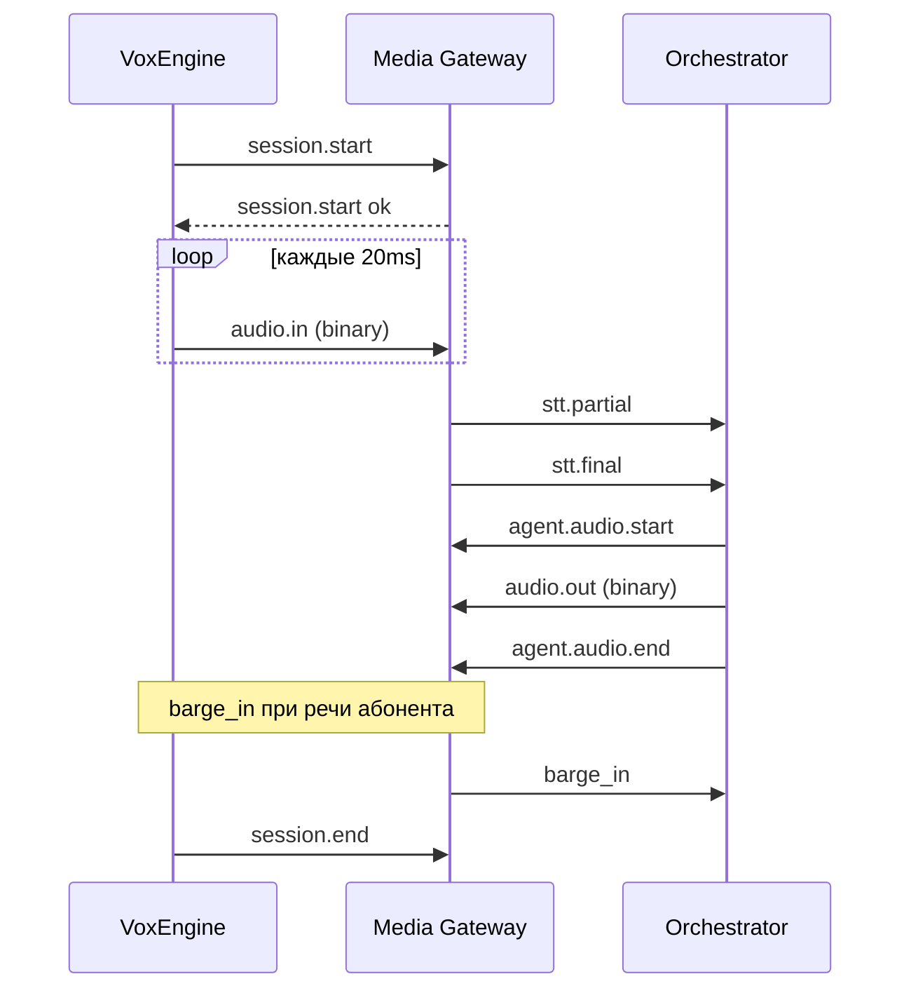

# Media session protocol v1

Транспорт: **WebSocket** (один сокет на звонок).  
Реализация-скелет: `telephony_media_gateway/src/protocol/events.ts`.

- **Control** — JSON text frames (`type` + `payload`).
- **Media** — binary frames с однобайтовым префиксом kind.

Версия протокола: `protocol_version: "1"` в `session.start`.

> ⚠️ **Важно**: Формат медиа-сообщений Voximplant критически важен для работы звука!
> См. подробную документацию: [VOXIMPLANT_MEDIA_FORMAT.md](./VOXIMPLANT_MEDIA_FORMAT.md)
>
> История: Ранее была проблема, когда звук агента не воспроизводился абоненту.
> Причина: медиа передавалось в неверном формате. Исправлено строгим
> следованием документации Voximplant.

---

## 1. Установление сессии

### `session.start` (client → gateway)

Обязательно **первое** control-сообщение после connect.

```json
{
  "type": "session.start",
  "payload": {
    "call_id": "vox-abc-123",
    "connection_id": 42,
    "caller_e164": "+79001234567",
    "codec": "pcmu",
    "called_number": "+74951234567",
    "protocol_version": "1"
  }
}
```

| Поле | Тип | Обязательно | Описание |
|------|-----|-------------|----------|
| `call_id` | string | да | Внешний ID звонка (Voximplant) |
| `connection_id` | int | да | `AgentChannelConnection.id` |
| `caller_e164` | string | да | CLI абонента |
| `codec` | `pcmu` \| `pcma` | да | G.711 μ-law / A-law |
| `called_number` | string | нет | DID / номер назначения |

**Ответ gateway:**

```json
{
  "type": "session.start",
  "payload": {
    "ok": true,
    "call_id": "vox-abc-123",
    "protocol_version": "1",
    "audio_frame_ms": 20
  }
}
```

### `session.end` (either)

Закрытие media-сессии.

```json
{ "type": "session.end", "payload": { "reason": "hangup" } }
```

**Reconnect:** при обрыве WS VoxEngine должен отправить `session.end` (`reason: ws_lost`), затем открыть новый сокет с тем же `call_id` и повторить `session.start`. Gateway сбрасывает VAD/STT state; orchestrator сохраняет hot dialog в Redis до `session.end` / `hangup`. Повторная доставка `stt.final` после reconnect не ожидается — только новые utterances.

### `call.transfer` (orchestrator → gateway → VoxEngine)

```json
{
  "type": "call.transfer",
  "payload": {
    "e164": "+79001234567",
    "announce_text": "Сейчас соединю с оператором."
  }
}
```

VoxEngine выполняет `call.transfer(e164)`; `operator_transfer_e164` берётся из resolve (bridge response / customData), без HTTP `/turn`.

---

## 2. Binary audio frames

Префикс **1 byte** + payload (μ-law октеты, 20–30 ms @ 8 kHz).

| Kind (hex) | Имя | Направление | Описание |
|------------|-----|-------------|----------|
| `0x01` | `audio.in` | client → gateway | Речь абонента (от VoxEngine WS) |
| `0x02` | `audio.out` | gateway → client | Синтез / TTS к абоненту |

Пример (hex): `01 D5 D5 D5 …` — один кадр `audio.in`.

До `session.start` binary кадры отклоняются (`session_not_started`).

### Voximplant native media (этап 2)

При `call.sendMediaTo(webSocket, { encoding: ULAW })` Voximplant шлёт JSON:

```json
{
  "event": "media",
  "media": { "payload": "<base64 μ-law>" }
}
```

Gateway принимает это как `audio.in` и на этапе 2 отвечает loopback в том же формате (проверка RTP path).

---

## 3. STT (gateway → orchestrator)

Эмитируются gateway после VAD + streaming STT (этап 3+).

### `stt.partial`

```json
{
  "type": "stt.partial",
  "payload": {
    "text": "хочу запис",
    "confidence": 0.82,
    "stable": false
  }
}
```

### `stt.final`

После тишины ≥ `TURN_SILENCE_MS` (default 400 ms):

```json
{
  "type": "stt.final",
  "payload": {
    "text": "хочу записаться на завтра",
    "confidence": 0.91
  }
}
```

---

## 4. Agent audio (orchestrator → gateway → CPaaS)

Потоковый ответ агента (этап 5+).

| Событие | Назначение |
|---------|------------|
| `agent.audio.start` | Начало воспроизведения (сброс буфера) |
| `agent.audio.chunk` | Метаданные чанка (sequence); PCM16 (base64) в payload |
| `agent.audio.end` | Конец фразы агента |

```json
{ "type": "agent.audio.start", "payload": { "codec": "pcmu" } }
```

```json
{
  "type": "agent.audio.chunk",
  "payload": {
    "sequence": 3,
    "audio_pcm16_b64": "<base64 PCM16 8k mono, 20ms frame>"
  }
}
```

```json
{ "type": "agent.audio.end", "payload": { "reason": "complete" } }
```

### 4.1. Voximplant WebSocket Media Format (Критически важно)

При отправке аудио агента в Voximplant через WebSocket, gateway преобразует
внутренние события в формат, требуемый Voximplant:

**Порядок событий (строго обязателен):**

1. **Сначала** `event: "start"` с описанием формата:
```json
{
  "event": "start",
  "sequenceNumber": 0,
  "start": {
    "mediaFormat": {
      "encoding": "audio/l16",
      "sampleRate": 8000,
      "channels": 1
    }
  }
}
```

2. **Затем** `event: "media"` с аудио-данными:
```json
{
  "event": "media",
  "sequenceNumber": 1,
  "media": {
    "chunk": 1,
    "timestamp": 1623456789000,
    "payload": "<base64 PCM16 audio>"
  }
}
```

3. **В конце** `event: "stop"`:
```json
{
  "event": "stop",
  "sequenceNumber": 100
}
```

> ⚠️ **Критично**: Без события `"start"` Voximplant не распознает сообщения как медиа,
> и звук агента **не будет слышен** абоненту!
>
> См. полную документацию: [VOXIMPLANT_MEDIA_FORMAT.md](./VOXIMPLANT_MEDIA_FORMAT.md)
>
> Реализация: `telephony_media_gateway/src/ws/vox_media.ts`

---

## 5. Barge-in

### `barge_in` (gateway → orchestrator и gateway → VoxEngine)

VAD обнаружил речь абонента во время `agent.audio.*` (не принимается от клиента на WS):

**Redis / orchestrator:**

```json
{ "type": "barge_in", "payload": { "at_ms": 1240 } }
```

**WS к VoxEngine** (сразу после детекта, до ответа orchestrator):

```json
{ "type": "barge_in", "payload": { "at_ms": 1240, "clear_playback": true } }
```

Orchestrator: `stream_cancel` + `agent.audio.end` (`reason: barge_in`); текст уже озвученных синтагм — `telephony:spoken:{call_id}` → `interrupted_agent_text` на следующем `stt.final`. VoxEngine: `webSocket.clearMediaBuffer()`.

---

## 6. DTMF (опционально)

```json
{ "type": "dtmf", "payload": { "digit": "4" } }
```

Маршрутизация по добавочному — этап 7 (Redis), не HTTP webhook на каждую цифру.

---

## 7. Ошибки и keepalive

```json
{
  "type": "error",
  "payload": { "code": "invalid_session_start", "message": "call_id required" }
}
```

Ping (не в enum prod-событий, для health WS):

```json
{ "type": "ping" }
```

→ `{ "type": "pong", "payload": { "ts": 1710000000000 } }`

---

## 8. Что **не** входит в media WS

| Событие | Контур |
|---------|--------|
| `call.inbound`, `call.hangup` | Backend RFC-001 / bridge (control) |
| HTTP `/internal/telephony/turn` | Legacy до этапа 4; preview — `source: browser_preview` |
| Batch STT по `recording_url` | Deprecated prod-path |

---

## 9. Порядок типичного звонка (целевой)



---

## 10. Связанные файлы

- JSON Schema (черновик): [../../schemas/telephony/media_session.v1.schema.json](../../schemas/telephony/media_session.v1.schema.json)
- Архитектура: [STREAMING_ARCHITECTURE.md](./STREAMING_ARCHITECTURE.md)
- Формат Voximplant Media: [VOXIMPLANT_MEDIA_FORMAT.md](./VOXIMPLANT_MEDIA_FORMAT.md)
- Реализация: `telephony_media_gateway/src/ws/vox_media.ts`
- Реализация: `telephony_media_gateway/src/orch/agent_playback.ts`
- VoxEngine: `voxengine/lib/rsd_media_gateway.js`
