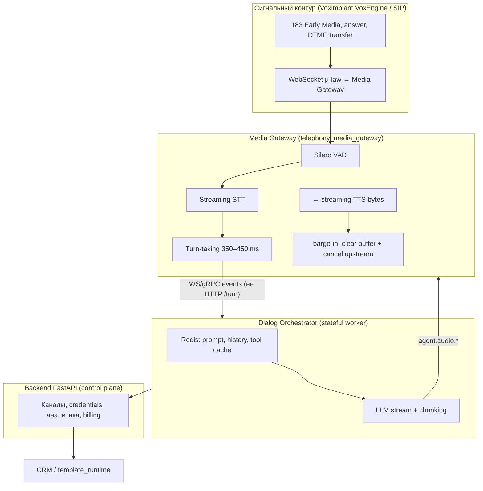

# Потоковая архитектура телефонии RSD

Целевая модель после рефакторинга ([TELEPHONY_STREAMING_REFACTOR.md](../../TELEPHONY_STREAMING_REFACTOR.md)). Этап 1 фиксирует границы **control plane** (backend + сигнальный webhook) и **media plane** (`telephony_media_gateway`).

## Диаграмма

## Разделение ответственности

| Контур | Компонент | Транспорт | Назначение |
|--------|-----------|-----------|------------|
| **Сигнальный** | VoxEngine + тонкий bridge (временно) | HTTP webhook RFC-001 | `call.inbound`, `call.answered`, `call.hangup`, DTMF |
| **Media** | `telephony_media_gateway` | WebSocket ([SESSION_PROTOCOL.md](./SESSION_PROTOCOL.md)) | Аудио G.711, VAD, STT, TTS, barge-in |
| **Диалог** | orchestrator worker (этап 4+) | WS/gRPC к gateway | LLM stream, Redis-сессия |
| **Control** | `backend` | REST internal + UI API | Resolve, метаданные звонка, preview **без** gateway |

## Текущий vs целевой prod-путь

| | Сейчас (до этапа 4) | Целевой |
|--|---------------------|---------|
| Реплика абонента | `record` → `call.recording_ready` → HTTP `/internal/telephony/turn` | `audio.in` → streaming STT → `stt.final` |
| Ответ агента | `play_tts` в Voximplant по готовому тексту | `agent.audio.*` + streaming TTS bytes |
| Preview в браузере | `POST /api/agents/telephony/preview/*`, `source: browser_preview` | Без изменений, без gateway |

## Артефакты этапа 1

| Артефакт | Путь |
|----------|------|
| Скелет gateway | `telephony_media_gateway/` |
| Протокол сессии | [SESSION_PROTOCOL.md](./SESSION_PROTOCOL.md) |
| Compose | `telephony_media_gateway` в `docker-compose.yml` |
| Control-only bridge | `telephony_bridge` — только `call.inbound` / `answered` / `hangup` |

## Env (media + control)

| Переменная | Назначение |
|------------|------------|
| `TELEPHONY_MEDIA_WS_URL` | URL для VoxEngine (`wss://host/ws`) |
| `TELEPHONY_BRIDGE_CONTROL_ONLY` | `true` (default в compose) — bridge без record/turn |
| `TELEPHONY_MEDIA_LOOPBACK_TRANSPORT` | `vox` \| `binary` — формат loopback (этап 2) |
| `PORT` (gateway) | `8200` по умолчанию |

См. [ENV_VARIABLES.md](./ENV_VARIABLES.md), [voxengine/README.md](../../voxengine/README.md).

## Turn-taking (scope)

Prod использует **VAD silence** (`TURN_SILENCE_MS`, default 400 ms) для `stt.final`. Отдельная модель «текст + интонация» в gateway **не** подключена — при появлении требования добавляется как опциональный слой поверх VAD.

## CRM / function_calling (blocking)

Для `template_type != qa` orchestrator вызывает `template_runtime.execute()` целиком (**blocking CRM**), затем нарезает ответ на синтагмы. При выполнении дольше `TELEPHONY_CRM_FILLER_THRESHOLD_MS` (default 1500) в gateway уходит `agent.play_filler`. Метрика `crm_execute_ms` пишется в `latency_budget` на звонке.

## Этап 2 (реализовано)

- VoxEngine: Early Media → greeting → answer → WS + μ-law (`call.sendMediaTo`).
- Gateway: приём Vox JSON media, RTF в логах, loopback для проверки RTP.
- Bridge: сигнальные webhook без `answer` / `record` actions (при `TELEPHONY_BRIDGE_CONTROL_ONLY`).
